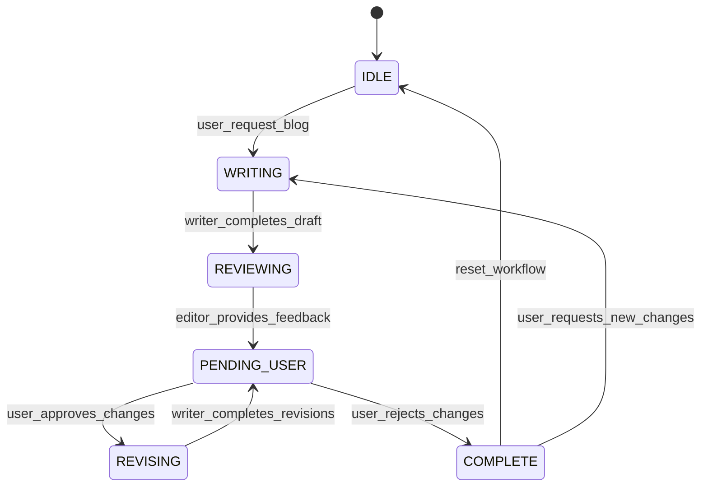

# Blog Workflow Finite State Machine (FSM)

## State Definitions

```
STATES = {
    IDLE,           # No active blog work
    WRITING,        # Writer agent is creating/modifying content
    REVIEWING,      # Editor agent is analyzing content
    PENDING_USER,   # Waiting for user approval
    REVISING,       # Writer implementing editor feedback
    COMPLETE        # Work finished, user satisfied
}
```

## State Transitions



## Transition Conditions

### From IDLE to WRITING
- **Trigger**: User provides content or requests blog creation
- **Action**: Invoke @technical-writer agent
- **Guard**: Valid user input provided

### From WRITING to REVIEWING  
- **Trigger**: Writer completes draft/revision
- **Action**: Invoke @blog-editor agent automatically
- **Guard**: Content file exists and is non-empty

### From REVIEWING to PENDING_USER
- **Trigger**: Editor completes review
- **Action**: Present feedback to user with approval prompt
- **Guard**: Editor has generated feedback

### From PENDING_USER to REVISING
- **Trigger**: User approves editor feedback ("yes")
- **Action**: Invoke @technical-writer with editor feedback
- **Guard**: User explicitly approves

### From PENDING_USER to COMPLETE
- **Trigger**: User rejects editor feedback ("no") 
- **Action**: Mark workflow as complete
- **Guard**: User explicitly rejects

### From REVISING to PENDING_USER
- **Trigger**: Writer completes implementing feedback
- **Action**: Ask user if they want another review cycle
- **Guard**: Revisions have been applied

### From COMPLETE to IDLE
- **Trigger**: User starts new blog or resets
- **Action**: Clean state, ready for new work
- **Guard**: No pending work

### From COMPLETE to WRITING
- **Trigger**: User requests additional changes to completed blog
- **Action**: Invoke @technical-writer with new requirements
- **Guard**: User provides specific change requests

## State Variables

```python
@dataclass
class WorkflowState:
    current_state: str
    blog_file_path: str | None = None
    iteration_count: int = 0
    last_editor_feedback: str | None = None
    user_satisfaction: bool = False
    max_iterations: int = 5  # Prevent infinite loops
```

## Implementation Logic

```python
class BlogWorkflowFSM:
    def __init__(self):
        self.state = "IDLE"
        self.context = WorkflowState(current_state="IDLE")
    
    def transition(self, trigger: str, **kwargs) -> str:
        transitions = {
            ("IDLE", "user_request_blog"): self._start_writing,
            ("WRITING", "writer_completes_draft"): self._start_review,
            ("REVIEWING", "editor_provides_feedback"): self._await_user_approval,
            ("PENDING_USER", "user_approves_changes"): self._start_revision,
            ("PENDING_USER", "user_rejects_changes"): self._complete_workflow,
            ("REVISING", "writer_completes_revisions"): self._check_iteration_limit,
            ("COMPLETE", "reset_workflow"): self._reset_to_idle,
            ("COMPLETE", "user_requests_new_changes"): self._start_writing,
        }
        
        handler = transitions.get((self.state, trigger))
        if handler:
            return handler(**kwargs)
        else:
            raise ValueError(f"Invalid transition: {self.state} -> {trigger}")
    
    def _start_writing(self, user_input: str, file_path: str = None) -> str:
        self.state = "WRITING"
        self.context.blog_file_path = file_path
        return "@technical-writer " + user_input
    
    def _start_review(self, file_path: str) -> str:
        self.state = "REVIEWING" 
        return f"@blog-editor Please review {file_path}"
    
    def _await_user_approval(self, feedback: str) -> str:
        self.state = "PENDING_USER"
        self.context.last_editor_feedback = feedback
        return "Would you like @technical-writer to implement these improvements? (yes/no)"
    
    def _start_revision(self) -> str:
        self.state = "REVISING"
        self.context.iteration_count += 1
        return f"@technical-writer implement editor feedback: {self.context.last_editor_feedback}"
    
    def _complete_workflow(self) -> str:
        self.state = "COMPLETE"
        self.context.user_satisfaction = True
        return "Blog workflow completed. Content is ready."
    
    def _check_iteration_limit(self) -> str:
        if self.context.iteration_count >= self.context.max_iterations:
            return self._complete_workflow()
        else:
            return self._await_user_approval("Revisions complete")
    
    def _reset_to_idle(self) -> str:
        self.state = "IDLE"
        self.context = WorkflowState(current_state="IDLE")
        return "Ready for new blog work"
```

## Safety Mechanisms

### Infinite Loop Prevention
- **Max iterations limit**: Prevent endless writer ↔ editor cycles
- **User approval gates**: Every transition through PENDING_USER requires explicit user consent
- **Timeout handling**: If no user response, default to COMPLETE after reasonable time

### Error Recovery
- **Invalid state transitions**: Log error and maintain current state
- **Agent failures**: Fall back to previous stable state
- **File corruption**: Backup previous versions before modifications

## Agent Integration

### Technical Writer Agent Hooks
```markdown
## FSM Integration
- On completion: `fsm.transition("writer_completes_draft", file_path=...)`
- On revision completion: `fsm.transition("writer_completes_revisions")`
```

### Blog Editor Agent Hooks  
```markdown
## FSM Integration
- On review completion: `fsm.transition("editor_provides_feedback", feedback=...)`
```

### User Interaction Hooks
```markdown
## FSM Integration
- User approval: `fsm.transition("user_approves_changes")`
- User rejection: `fsm.transition("user_rejects_changes")`
- New blog request: `fsm.transition("user_request_blog", input=...)`
```

## Benefits of FSM Design

1. **Predictable workflow**: Clear state transitions prevent confusion
2. **Loop prevention**: Built-in safeguards against infinite cycles  
3. **User control**: User approval required for all automated actions
4. **Debugging**: Easy to trace workflow issues through states
5. **Extensibility**: Easy to add new states (e.g., PUBLISHING, ARCHIVING)
6. **Consistency**: Enforces proper workflow regardless of entry point

This FSM formalizes our current writer-editor chain while providing safety mechanisms and clear workflow control.