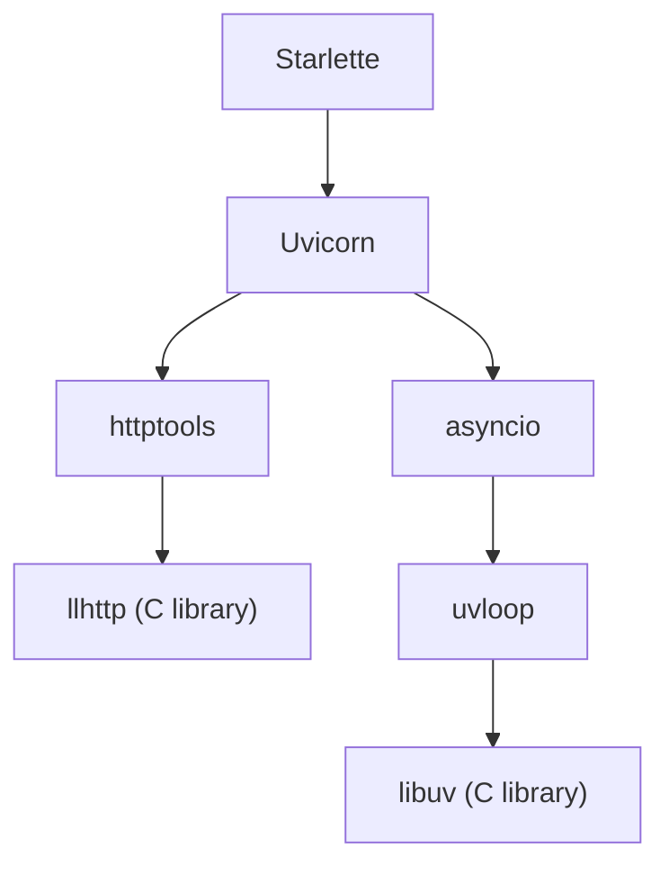
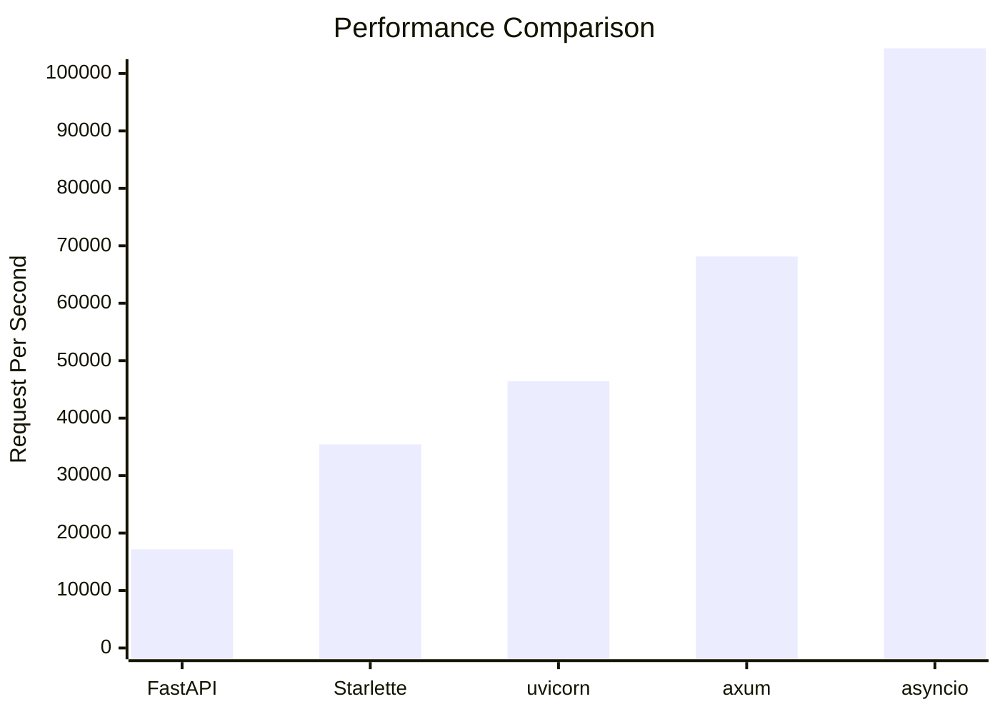
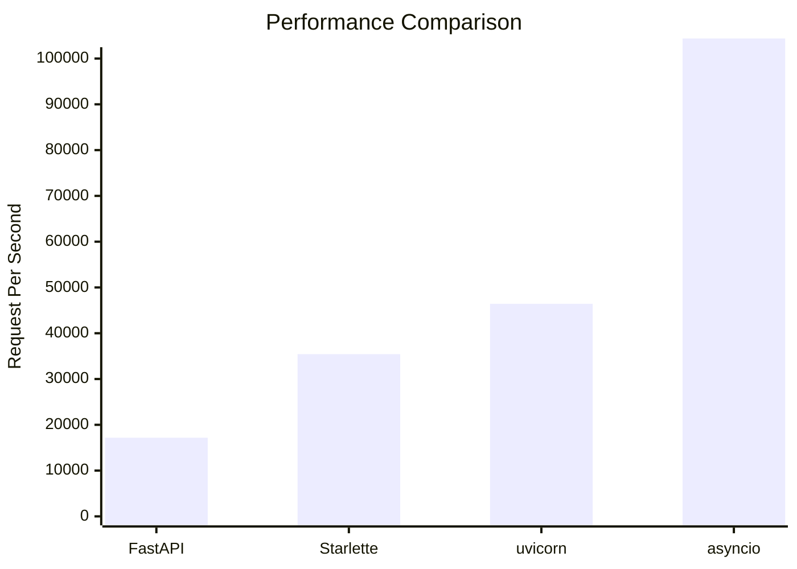

# How Fast can a python web framework be

## An anatomy of modern ASGI framework

- Starlette, or other ASGI webframeworks, such as `lihil`
- Uvicorn
- asyncio
- uvloop
- httptools



We are going to focus on `Starlette`, `Uvicorn` and `asyncio`

## Test procedures

1.  send a `post` request with following data
2.  when receive the request body, deseriaze the body into a `User` , 
3.  make a new `User`  based on the received `User` 
4.  respond the request with a serialized new `User`  

## Bonus - axum

## axum
```rust
use axum::{
    routing::post,
    Json, Router,
};
use serde_derive::{Deserialize, Serialize}; // Changed this line
use tokio::net::TcpListener;

#[derive(Deserialize, Serialize)]
struct User {
    id: i32,
    name: String,
    email: String,
}

#[tokio::main]
async fn main() {
    // Build our application with a single POST route
    let app = Router::new().route("/user", post(create_user));
    
    // Run our app with hyper, listening globally on port 8000
    let listener = TcpListener::bind("0.0.0.0:8000").await.unwrap();
    println!("Server running on http://0.0.0.0:8000");
    axum::serve(listener, app).await.unwrap();
}

// Handler function that receives the JSON and returns the same data
async fn create_user(
    Json(user): Json<User>,
) -> Json<User> {
    Json(user)
}
```

### Result

```python
Running 10s test @ http://localhost:8000/user
  2 threads and 10 connections
  Thread Stats   Avg      Stdev     Max   +/- Stdev
    Latency   141.10us   28.93us 508.00us   71.74%
    Req/Sec    34.24k   487.51    35.74k    76.73%
  688132 requests in 10.10s, 101.72MB read
Requests/sec:  68133.61
Transfer/sec:     10.07MB
```




## asyncio

```python
import asyncio
from asyncio import StreamReader, StreamWriter
import uvloop

from .share import endpoint

async def handle_client(reader: StreamReader, writer: StreamWriter):
    while True:
        try:
            # Read the full request data
            request_data = await reader.read(1024)
            if not request_data:
                break

            req = request_data.split(b"\r\n")
            method, host, user_agent, *_, content_length, body = req

            # Process the request and get response data
            res = endpoint(body)

            # Create and send the response with the body
            response = (
                "HTTP/1.1 200 OK\r\n"
                f"Content-Length: {len(res)}\r\n"
                "Content-Type: application/json\r\n"
                "Connection: keep-alive\r\n"  # Keep the connection alive
                "\r\n"
            ).encode() + user

            writer.write(response)
            await writer.drain()
        except Exception:
            # Only close on error
            writer.close()
            await writer.wait_closed()
            break

async def main():
    port = 8000
    print(f"asyncio server started at {port}")
    server = await asyncio.start_server(handle_client, "127.0.0.1", port)

    async with server:
        await server.serve_forever()

if __name__ == "__main__":
    uvloop.run(main())
```
### Result
```python
Running 10s test @ http://localhost:8000
  2 threads and 10 connections
  Thread Stats   Avg      Stdev     Max   +/- Stdev
    Latency    92.76us   33.30us 523.00us   71.90%
    Req/Sec    52.70k     8.19k   91.82k    69.65%
  1054145 requests in 10.10s, 142.75MB read
Requests/sec: 104379.61
```

## Uvicorn

```python
from uvicorn._types import ASGIReceiveCallable, ASGISendCallable, Scope

from .share import endpoint


async def app(
    scope: Scope,
    receive: ASGIReceiveCallable,
    send: ASGISendCallable,
):
    """
    ASGI application that handles user data.
    """
    if scope["type"] != "http":
        return

    # Receive the HTTP body
    body: bytes = b""

    while True:
        message = await receive()
        body += message.get("body", b"")
        if not message.get("more_body", False):
            break

    res = endpoint(body)
    content_lengh = str(len(res)).encode()

    # Send response headers
    await send(
        {
            "type": "http.response.start",
            "status": 200,
            "headers": (
                (b"content-type", b"application/json"),
                (b"content-length", content_lengh),
            ),
        }
    )

    # Send response body
    await send(
        {
            "type": "http.response.body",
            "body": res,
        }
    )

```

### Result

```python
Running 10s test @ http://localhost:8000
  2 threads and 10 connections
  Thread Stats   Avg      Stdev     Max   +/- Stdev
    Latency   212.76us   71.17us   1.31ms   72.43%
    Req/Sec    23.33k     2.04k   26.83k    61.39%
  468891 requests in 10.10s, 76.91MB read
Requests/sec:  46425.59
Transfer/sec:      7.62MB
```


## Starlette

```bash
python3 -m uvicorn --interface asgi3 --no-access-log --log-level "warning" --http httptools lihil.star_server:app
```

```python
from starlette.applications import Starlette
from starlette.requests import Request
from starlette.responses import Response

from .share import endpoint


async def msgspec_user(r: Request) -> Response:
    data = await r.body()
    res = endpoint(data)
    return Response(content=res)


app = Starlette()
app.add_route("/", msgspec_user, methods=["POST"])

```
### Result
```python
Running 10s test @ http://localhost:8000
  2 threads and 10 connections
  Thread Stats   Avg      Stdev     Max   +/- Stdev
    Latency   278.60us   91.74us   1.92ms   62.14%
    Req/Sec    17.80k     3.85k   22.57k    46.53%
  357872 requests in 10.10s, 47.78MB read
Requests/sec:  35433.13
Transfer/sec:      4.73MB
```


## FastAPI

```bash
python3 -m uvicorn --interface asgi3 --no-access-log --log-level "warning" --http httptools lihil.star_server:app
```

```python
from fastapi import FastAPI
from pydantic import BaseModel


class User(BaseModel):
    id: int
    name: str
    email: str


async def pydantic_user(user: User) -> User:
    u = User(id=user.id, name=user.name, email=user.email)
    return u


app = FastAPI()
app.add_api_route(path="/", endpoint=pydantic_user, methods=["POST"])
```

### Result

```python
Running 10s test @ http://localhost:8000
  2 threads and 10 connections
  Thread Stats   Avg      Stdev     Max   +/- Stdev
    Latency   578.91us  188.09us   2.50ms   60.37%
    Req/Sec     8.63k   587.53     9.87k    62.87%
  173490 requests in 10.10s, 28.46MB read
Requests/sec:  17177.50
Transfer/sec:      2.82MB
```

why?

Lets start with a simple modification with fastapi

```python
from typing import Any, Callable, Coroutine

from fastapi import FastAPI
from fastapi.routing import APIRoute
from pydantic import BaseModel, TypeAdapter
from starlette.requests import Request
from starlette.responses import Response


class User(BaseModel):
    id: int
    name: str
    email: str


adapter = TypeAdapter(User)
decode = adapter.validate_json
encode = adapter.dump_json

class DumpRoute(APIRoute):
    def get_route_handler(self) -> Callable[[Request], Coroutine[Any, Any, Response]]:
        async def app(request: Request) -> Response:
            body = await request.body()
            res = self.endpoint(body)
            return Response(res)

        return app


app = FastAPI()
app.router.add_api_route(
    path="/", route_class_override=DumpRoute, endpoint=endpoint, methods=["POST"]
)

```

### Result
```python
Running 10s test @ http://localhost:8000
  2 threads and 10 connections
  Thread Stats   Avg      Stdev     Max   +/- Stdev
    Latency   337.33us  112.16us   2.18ms   62.27%
    Req/Sec    14.77k     1.05k   16.78k    65.84%
  296891 requests in 10.10s, 39.64MB read
Requests/sec:  29396.83
Transfer/sec:      3.92MB
```

if we use msgspec.Struct for `User`

### Result
```python
Running 10s test @ http://localhost:8000
  2 threads and 10 connections
  Thread Stats   Avg      Stdev     Max   +/- Stdev
    Latency   304.16us  101.28us   1.67ms   67.06%
    Req/Sec    16.33k     1.03k   18.04k    69.31%
  328217 requests in 10.10s, 43.82MB read
Requests/sec:  32498.99
Transfer/sec:      4.34MB
`````

| framework | RPS     | decay %   |
| --------- | ------- | --------- |
| asyncio   | 104,380 | (- 100%)  |
| Uvicorn   | 46,426  | (↓ 55.5%) |
| Starlette | 35,433  | (↓ 23.7%) |
| FastAPI   | 17,178  | (↓ 51.5%) |





## Code used

 wrk/scripts/post.lua
```lua
  0 -- example HTTP POST script which demonstrates setting the                               
  1 -- HTTP method, body, and adding a header
  2 
  3 wrk.method = "POST"
 ~  wrk.body   = '{"id": 1, "name": "user", "email": "user@email.com"}'
 ~  wrk.headers["Content-Type"] = "application/json"
```

```bash
wrk http://localhost:8000 -s scripts/post.lua
```

```bash
curl -X POST -H "Content-Type: application/json" -d '{"id":1,"name":"user","email":"user@email.com"}' http://localhost:8000
```

```toml
requires-python = ">=3.12"
dependencies = [
    "fastapi>=0.115.8",
    "httptools>=0.6.4",
    "msgspec>=0.19.0",
    "orjson>=3.10.15",
    "starlette>=0.45.3",
    "uvicorn>=0.34.0",
]
```


**share.py**
```python
from msgspec import Struct
from msgspec.json import Decoder, Encoder


class User(Struct):
    id: int
    name: str
    email: str


encoder = Encoder()
decoder = Decoder(User)
encode = encoder.encode
decode = decoder.decode


def endpoint(data: bytes) -> bytes:
    received = decode(data)
    respond = User(id=received.id, name=received.name, email=received.email)
    user = encode(respond)
    return user

```
