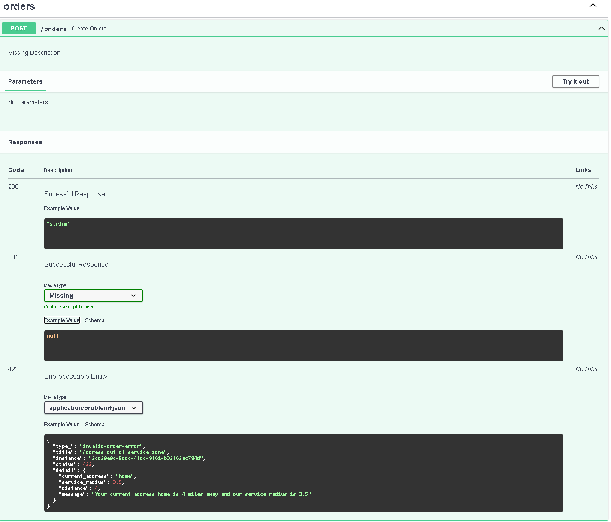

### Question:

**How would you choose a status code for an order that could not be processed because the customer's shipping address is outside the delivery zone?**

<!-- truncate -->

<details>

<summary>Spoiler</summary>

### You shouldn't be looking for a specific status code for busineess error.

Instead, use a 4xx status code with a well-defined structural error response and provide detailed documentation of the error response format.

</details>


HTTP status codes have long been a cornerstone of web application error handling. Defined in RFC 7231, these codes serve as a standardized way for servers to communicate the outcome of a request to the client. The standard defines several categories of status codes, such as `2xx` for success, `4xx` for client errors, and `5xx` for server errors.

Quote from [RFC 7231](https://datatracker.ietf.org/doc/html/rfc7231#section-8.2.2):

> HTTP clients are not required to
   understand the meaning of all registered status codes, though such
   understanding is obviously desirable.  However, a client MUST
   understand the class of any status code, as indicated by the first
   digit, and treat an unrecognized status code as being equivalent to
   the x00 status code of that class

It has become an industrial consensus to check these status codes as a way to quickly determine whether a request was successful or failed. For example, many libraries and frameworks will raise an exception if a request results in an error status. Here's a simple example using Python's `requests` library:

```python
import requests

response = requests.get("https://api.example.com/data")
response.raise_for_status() # this would raise exception when status code > 400
print("Data retrieved successfully!")
```

> In this example, `raise_for_status()` automatically raises an `HTTPError` if the server returns a 4xx or 5xx status code. This is a common pattern in many applications to ensure that only successful requests are processed further.

For business logic errors, it's common to use `4xx` codes like `400 Bad Request` or `403 Forbidden` when something goes wrong. For example, a "premium" user trying to access a feature available only to "pro" users might return a `403 Forbidden` status. In such cases, the error is clear, and the status code maps well to the scenario.

But as web applications grow in complexity and deal with more nuanced business rules, things get trickier. Consider a scenario where **an order could not be processed because of a mismatch between the customer's shipping address and the delivery zone**. How should this issue be represented in terms of HTTP status codes?

There isn't an easy or clear answer. While we could use `400 Bad Request`, it doesn't quite capture the specific business rule violation that's occurring. Similarly, a `409 Conflict` could work in some cases, but it still doesn’t feel precise enough. As the number of potential issues grows—whether they’re related to payment failures, address mismatches, or resource conflicts—the more apparent it becomes that HTTP status codes are not built to handle the full complexity of modern business logic.


### What Do People Do?

Currently, there are a few ways the industry deals with the problem of handling business logic errors in web applications. These solutions often involve workarounds or generalizations due to the limitations of HTTP status codes. Here are some of the common approaches:

#### Bad

1. **Embedding Custom Status Inside Request Body**  

One approach is to always return a `200 OK` status code, even when the request fails, and include a custom status code in the response body. This method involves returning a business-specific error code along with additional details. 

   **Example**:
```json
   {
       "business_code": "CUSTOMIZED_BUSINESS_ERROR",
       "detail": "The shipping address is outside the serviceable delivery zone."
   }
```

   I have personally encountered this solution from my work a several times during my career. when the system contains only a few components, and with detailed documentation, it could work, but as the system grows and additional components (like proxies, API gateways, and logging systems) are added, this keeps creating new problems you wouldn't have to solve otherwise.

2.  self-define 3-digits status code, for example, 6xx means some business rules, 700 means others, etc. 

Some solutions attempt to define their own set of status codes beyond the standard `2xx`, `4xx`, and `5xx` categories. For example, `6xx` might represent business rules, with specific codes for each scenario (e.g., `700` for some other business logic). While this avoids reading the request body to determine failure, it violates the HTTP standards, meaning many tools might throw errors or not support these codes.
   **Example**: 
```python
600: CONNECTION ERROR - This indicates a general connection error
601: INCOMPLETE ERROR - This indicates sever sends an incomplete page/object (as indicated by Content-Length header)
701: ERROR TEXT FOUND - This code is returned if any error text (such as, "Service Unavailable") are found in the main page (frame HTML contents included). Note that the error text must be defined in advance of the test. Error text means if the text is found, this session should be considered a failure.
```


According to [RFC 7231](https://datatracker.ietf.org/doc/html/rfc7231#section-8.2.2), 
> New status codes are required to fall under one of the categories
   defined in [Section 6](https://datatracker.ietf.org/doc/html/rfc7231#section-6).

status codes >= 600 are invalid because they fall outside of the defined categories.


#### OK

1. **A 4xx status code + Generic Error Message**  

```json
{
  "status": 400,
  "message": "Something went wrong"
}
```

A common fallback is to return a `4xx` status code (typically `400 Bad Request`) and include a generic error message such as "Something went wrong" in the response body. This approach hides the real cause of the business logic failure and lumps all client errors into one vague category. While this might suffice for small-scale applications or early prototypes, it quickly becomes inadequate as the complexity of business rules increases.

Some systems go a step further by returning a one-line reason phrase or a slightly extended message, but still fall short of conveying structured, actionable error details to clients.

2. **Using the Same Status Code for Multiple Business Logic Issues**  

```json
{
  "status": 400,
  "message": "Payment failed"
}

{
  "status": 400,
  "message": "Invalid shipping address"
}
```

As business logic errors grow in number and variety, some teams attempt to fit them into a limited set of existing status codes. For instance, both a payment failure due to insufficient funds and a mismatch in shipping address might be returned as `400 Bad Request`. While this approach simplifies server-side handling, it severely limits the clarity of error messages, making it hard for clients to distinguish between different types of business failures. This also places unnecessary burden on client-side developers to reverse-engineer the true nature of the error from vague responses.


#### Good 

**Structured Error Message + Documentation (With Standards Compliance)**  

A thoughtful approach to business rule violations is to return an appropriate `4xx` status code—ideally one that aligns semantically with the error (for example, `407 Proxy Authentication Required`, if applicable)—to indicate that the request was unsuccessful due to a business constraint.

In addition, the response body can include a **structured error message** based on [RFC 9457 (Problem Details for HTTP APIs)](https://datatracker.ietf.org/doc/html/rfc9457), which defines fields such as `type`, `title`, `status`, `detail`, and `instance`. This format encourages clarity and consistency, making it easier for both developers and automated systems to understand, handle, and trace errors.

Equally important is having each error type **clearly documented** so that client developers know what an error means and how to address it. Well-maintained documentation enables richer client experiences, reduces guesswork, and helps prevent issues before they arise.

Stripe does an excellent job in this area with their [dedicated error code documentation](https://docs.stripe.com/error-codes), which provides detailed explanations for a wide range of business-related errors. Their commitment to transparency and developer experience is evident and commendable.

That said, there are a couple of areas where further improvements could enhance the experience even more:

- Their structured error format, while clear, doesn’t explicitly follow RFC 9457, and omits fields like `instance` that can be valuable for debugging.
- It’s not clear whether their documentation is automatically generated or manually maintained. If it’s the latter, this could introduce challenges in keeping it fully up to date with evolving APIs.

### How lihil solves this problem

**Structured Error Messages + Auto-Generated Documentation**

`lihil` tackles the problem by making structured error handling first-class. You can declare rich, type-safe exceptions by subclassing `HTTPException[T]`, where `T` defines the structure of the error's `detail` field. These exceptions can then be directly attached to endpoints using the `errors=` parameter. This not only ensures consistent error responses but also enables `lihil` to automatically generate OpenAPI documentation for each declared error—including a link to a detailed problem page under the "External documentation" tab.

Every error response follows the [RFC 9457](https://datatracker.ietf.org/doc/html/rfc9457) format, including fields like `type`, `title`, `status`, `detail`, and `instance`. You can customize how errors are rendered by registering handlers with `@problem_solver`, which maps specific exceptions or status codes to structured responses. Specific exception handlers take precedence over status-code-based ones, giving you fine-grained control.

By default, `lihil` also generates detailed responses for common issues such as missing parameters, returning structured 422 responses for `InvalidRequestErrors`—complete with field-level information. These responses are not only machine-readable but also fully documented out of the box.

Best of all, all this documentation is automatically synced with your code. There's no need to manually update or maintain a separate error code reference. `lihil` keeps your API behavior and documentation in perfect alignment.

```python
from lihil import Empty, Lihil, Resp, Route, status, Meta
from lihil.interface import Base
from lihil.problems import HTTPException

class AddressOutOfScopeProblem(Base):
    current_address: Annotated[str, Meta(examples=["home"])]
    service_radius: Annotated[float, Meta(examples=[3.5])]
    distance: Annotated[float, Meta(examples=4)]

    message: str = ""

    def __post_init__(self):
        self.message = f"Your current address {self.current_address} is {self.distance} miles away and our service radius is {self.service_radius}"

class InvalidOrderError(HTTPException[AddressOutOfScopeProblem]):
    "Address out of service zone"
    __status__ = 422

    instance: Annotated[str, Meta(examples=["2cd20e0c-9ddc-4fdc-8f61-b32f62ac784d"])]
    detail: AddressOutOfScopeProblem


orders = Route("orders")

@orders.post(errors=[InvalidOrderError])
async def create_orders() -> Resp[Empty, status.CREATED]: ...

lhl = Lihil(routes=[orders])

if __name__ == "__main__":
    lhl.run(__file__)
```


You would be able to the example response on OpenAPI at "/docs", asd well as the dedicated problem page at "/problems"




