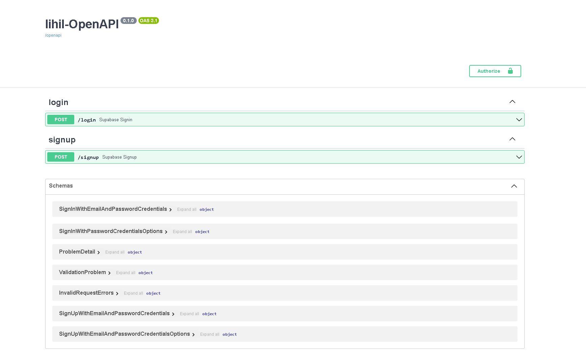
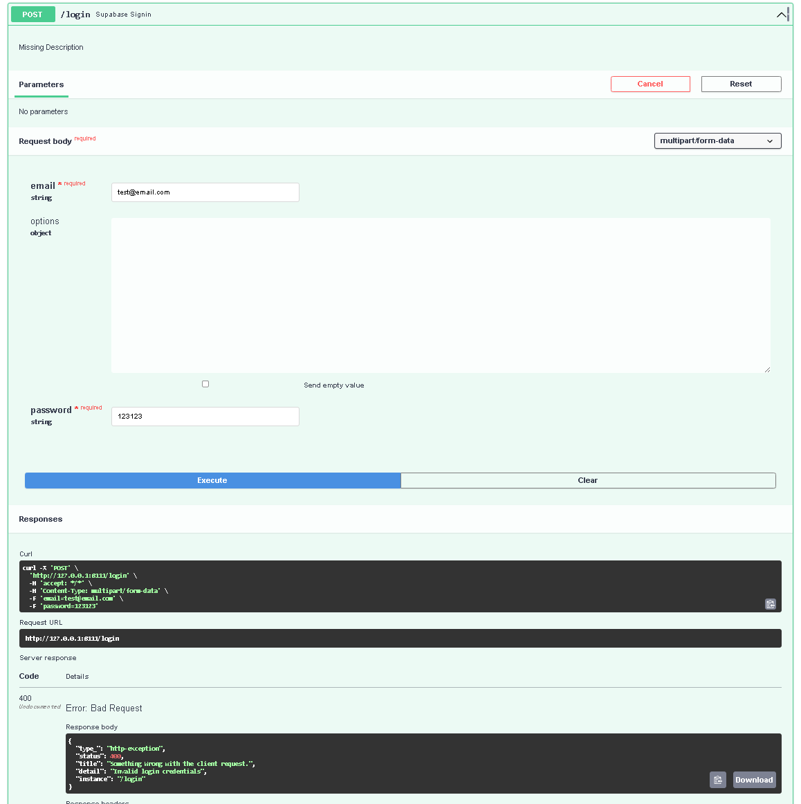

As someone who has worked on multiple web projects, I’ve found user authentication to be a recurring pain point. Whether I was integrating a third-party auth provider like Supabase, or worse — rolling my own auth system — I often found myself rewriting the same boilerplate:

- Configuring JWTs

- Decoding tokens from headers
- Serializing them back
- Hashing passwords
- Validating login credentials

And that’s not even touching error handling, route wiring, or OpenAPI documentation.

So I built lihil-auth, a plugin system that makes user authentication a breeze. It supports both third-party platforms like `Supabase` and self-hosted solutions using JWT — with minimal effort.

<!-- truncate -->

### Supabase Auth in One Line

If you're using Supabase, setting up authentication is as simple as:

```python
from lihil import Lihil
from lihil.plugins.auth.supabase import signin_route_factory, signup_route_factory

app = Lihil()
app.include_routes(
    signin_route_factory(route_path="/login"),
    signup_route_factory(route_path="/signup"),
)
```

Here, `signin_route_factory` and `signup_route_factory` generate the `/login` and `/signup` routes for you, respectively. They handle everything from user registration to login, including password hashing and JWT generation(thanks to supabase).

You can customize credential type by configuring `sign_up_with` parameter, where you might want to use `phone` instead of `email` for signing up users.

These routes immediately become available in your OpenAPI docs (/docs), allowing you to explore, debug, and test them interactively(thanks to swagger-ui):




With just that, you have a ready-to-use login route backed by Supabase.

#### Full docs: [Supabase Plugin Documentation](https://lihil.cc/docs/advance/plugin/supabase)

### Want to use Your Own Database?

No problem. The JWT plugin lets you manage users and passwords your own way, while lihil takes care of encoding/decoding JWTs and injecting them as typed objects.

#### Basic JWT Authentication Example

You might want to include public user profile information in your JWT, such as user ID and role.
so that you don't have to query the database for every request.

```python
from lihil import Payload, Route
from lihil.plugins.auth.jwt import JWTAuthParam, JWTAuthPlugin, JWTConfig
from lihil.plugins.auth.oauth import OAuth2PasswordFlow, OAuthLoginForm

me = Route("/me")
token = Route("/token")

jwt_auth_plugin = JWTAuthPlugin(jwt_secret="mysecret", jwt_algorithms="HS256")

class UserProfile(Struct):
    user_id: str = field(name="sub")
    role: Literal["admin", "user"] = "user"

@me.get(auth_scheme=OAuth2PasswordFlow(token_url="token"), plugins=[jwt_auth_plugin.decode_plugin()])
async def get_user(profile: Annotated[UserProfile, JWTAuthParam]) -> User:
    assert profile.role == "user"
    return User(name="user", email="user@email.com")

@token.post(plugins=[jwt_auth_plugin.encode_plugin(expires_in_s=3600)])
async def login_get_token(credentials: OAuthLoginForm) -> UserProfile:
    return UserProfile(user_id="user123")
```

Here we define a `UserProfile` struct that includes the user ID and role, we then might use the `role` to determine access permissions in our application.

You might wonder if we can trust the `role` field in the JWT. The answer is yes, because the JWT is signed with a secret key, meaning that any information
encoded in the JWT is `read-only` and cannot be tampered with by the client. If the client tries to modify the JWT, the signature will no longer match, and the server will reject the token.

This also means that you should not include any sensitive information in the JWT, as it can be decoded by anyone who has access to the token.

We then use `jwt_auth_plugin.decode_plugin` to decode the JWT and inject the `UserProfile` into the request handler.
When you return `UserProfile` from `login_get_token`, it will automatically be serialized as a JSON Web Token.

By default, the JWT would be returned as oauth2 token response, but you can also return it as a simple string if you prefer.
You can change this behavior by setting `scheme_type` in `encode_plugin`

```python
class OAuth2Token(Base):
    access_token: str
    expires_in: int
    token_type: Literal["Bearer"] = "Bearer"
    refresh_token: Unset[str] = UNSET
    scope: Unset[str] = UNSET
```

The client can receive the JWT and update its header for subsequent requests:

```python
token_data = await res.json()
token_type, token = token_data["token_type"], token_data["access_token"]

headers = {"Authorization": f"{token_type.capitalize()} {token}"} # use this header for subsequent requests
```

#### Role-Based Authorization Example

You can utilize function dependencies to enforce role-based access control in your application.

```python
def is_admin(profile: Annotated[UserProfile, JWTAuthParam]) -> bool:
    if profile.role != "admin":
        raise HTTPException(problem_status=403, detail="Forbidden: Admin access required")

@me.get(auth_scheme=OAuth2PasswordFlow(token_url="token"), plugins=[jwt_auth_plugin.decode_plugin()])
async def get_admin_user(profile: Annotated[UserProfile, JWTAuthParam], _: Annotated[bool, use(is_admin)]) -> User:
    return User(name="user", email="user@email.com")
```

Here, for the `get_admin_user` endpoint, we define a function dependency `is_admin` that checks if the user has an admin role. If the user does not have the required role, the request will fail with a 403 Forbidden Error .

#### Returning Simple String Tokens

In some cases, you might always want to query the database for user information, and you don't need to return a structured object like `UserProfile`. Instead, you can return a simple string value that will be encoded as a JWT.

If so, you can simply return a string from the `login_get_token` endpoint, and it will be encoded as a JWT automatically:

```python
@token.post(plugins=[jwt_auth_plugin.encode_plugin(expires_in_s=3600)])
async def login_get_token(credentials: OAuthLoginForm) -> str:
    return "user123"
```

#### Full docs: [JWT Plugin Documentation](https://lihil.cc/docs/advance/plugin/jwt)

## Installation

### To use jwt only

```bash
pip install "lihil[standard]"
```

### To use both jwt and supabase

```bash
pip install "lihil[standard,supabase]"
```

---

Github: [lihil](https://github.com/raceychan/lihil)

Official Docs: [lihil.cc](https://lihil.cc)
