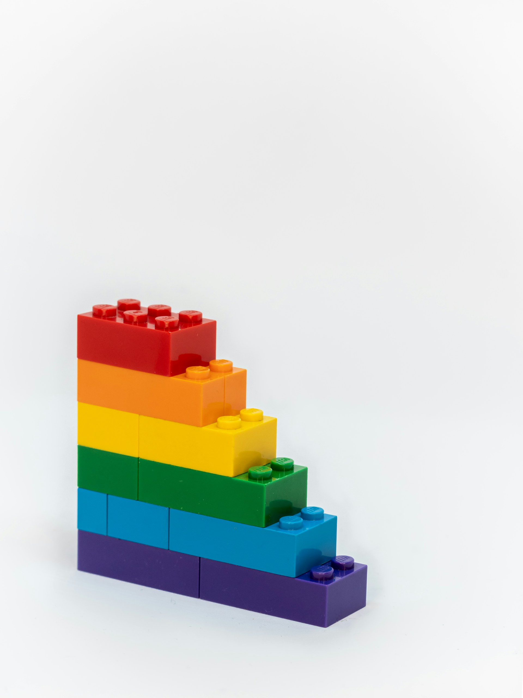

# Decorators and Functional Programming



I often see people ask how to "do functional programming in Python"—as if it requires special tools or libraries.

But the truth is, many Python developers are already using functional programming techniques without realizing it. One of the clearest examples is the use of decorators.

Decorators are not only a staple of modern Python codebases but also a practical bridge between traditional imperative programming and the functional programming paradigm.

<!-- truncate -->

## The Essence of Decorators

At their core, decorators are higher-order functions: a fundamental concept in functional programming.

### What is a Higher-Order Function?

According to Wikipedia, a higher-order function is a function that either(or both):

- Takes one or more functions as arguments
- Returns a function as its result.

Let me give a naive example for this

```python
from typing import Callable

def dummy(func: Callable[..., Any]) -> Callable[..., Any]:
    return func
```

At first glance, this dummy function seems trivial.

it just returns the function it receives without any modification.

However, with a slight adjustment, we can transform it into something more useful:

```python
from typing import ParamSpec, TypeVar

P, R = ParamSpec("P"), TypeVar("R")

def dummy(func: Callable[P, R]) -> Callable[P, R]:
    def wrapper(*args: P.args, **kwargs: P.kwargs) -> R:
        result = func(*args, **kwargs)
        return result
    return wrapper
```

This is a decorator! In Python, decorators satisfy both criteria:
 they take a function as input and often return a new function(in our example, `wrapper`) with modified behavior.

So, decorators in Python are not just a convenient syntax—they’re a direct, real-world application of higher-order function concepts.

### Functions as First-Class Citizens

How can Python support decorators so seamlessly? The answer lies in a foundational language feature: functions are first-class citizens.

This means functions in Python can be:

- Assigned to variables
  we can do inside `wrapper`

  ```python
  new_func = func
  result = func(*args, **kwargs)
  ```

- Passed as arguments
  This

  ```python
  @dummy
  def add(a: int, b: int) -> int:
      return a + b
  ```

  is equivalent to

  ```python
  add = dummy(add)
  ```

  when we decorate `add` with `dummy`, python would automatically passes `add` as an argument to `dummy`

- Returned from other functions
  Inside `dummy`, we return `wrapper` as a value, which is a function defined within `dummy`.

- Stored in data structures like lists or dictionaries
  we won't dig deep into this, but when dummy is defined, it is stored within module's global namespace, which is a dict under the hood.

In contrast, in some statically typed or older programming languages(say java before java 8), functions are not first-class.

This would break in pre-java8

```java
public class Example {
    public static void callTwice(Function func) {
        func(); // Error: not a valid function call
        func();
    }

    public static void main(String[] args) {
        callTwice(sayHello); // sayHello isn't a value
    }

    public static void sayHello() {
        System.out.println("Hello");
    }
}
```

## Therefore...

If you've used a decorator like `@functools.lru_cache`, `@app.get`, or `@login_required`, then you've already dipped your toes into functional programming. You’re working with functions that modify or enhance the behavior of other functions—precisely the kind of thing functional programming is all about.

## Functional Programming with Decorators

Decorators don't just align with functional programming.

they can enable several important techniques:

### 1. Function Composition
   In functional programming, composition is the idea of building complex behavior by combining simple functions. Decorators can be used to layer transformations or validations around a core function, much like composing small functions into a pipeline.

   You can chain multiple decorators to achieve a composition-like behavior, each adding behavior before or after the main function is run.

   ```python
   @decor1
   @decor2
   @decor3
   def decor(a: int, b: int) -> int: ...
   ```

   This pattern is powerful, but it comes with some caveats:

   - Signature incompatibility: 
   If one decorator modifies the function’s signature (e.g., changes the number or type of arguments), it may break compatibility with other decorators in the chain.For decorators that need to inspect the function signature, if one decorator does not preserve it, the others may break.

   - Order sensitivity: The order in which decorators are applied matters. For example, using `@abc.abstractmethod` on a method that has already been wrapped by another decorator may lead to incorrect behavior or errors.

   - Readability: As the number of decorators grows, it becomes harder to understand what the function actually does at a glance.

   #### Example from lihil

   In lihil, an endpoint can receive multiple plugins (which are essentially decorators) using a cleaner and more structured syntax:

   ```python
   @user.post(plugins=[plugin1, plugin2, plugin3])
   async def create_user(): ...
   ```

   Under the hood, lihil applies these plugins in sequence by decorating the endpoint function:

   ```python
   for plugin in plugins:
       func = plugin(func)
   ```

   This approach maintains the core idea of composition while improving clarity and control over the decoration process.

### 2. Currying

   Currying is the process of transforming a function that takes multiple arguments into a sequence of functions that each take a single argument. While Python doesn't support automatic currying like Haskell, you can manually simulate currying using decorators—returning nested functions that capture arguments through closure.

   This is especially powerful when writing configuration-like decorators, where parameters are fixed upfront and later used to modify a function's behavior.

   Consider the following example:

   ```python
    def curry(func: Callable[..., R], *curry_args: Any, **curry_kwargs: Any):
        def wrapper(*args: Any, **kwargs: Any) -> R:
            return func(*(curry_args + args), **(curry_kwargs | kwargs))
        return wrapper
   ```

   Here, curry is a higher-order function that returns a new function (wrapper) with some arguments pre-filled. These pre-filled values are remembered through closure, and the remaining arguments can be supplied later when the returned function is called.

   To demonstrate how this works, imagine a simple subtraction function:

   ```python
   def sub(a: int, b: int) -> int:
       return a - b

   sub_five = curry(sub, b=5)
   assert sub_five(a=8) == 3
   ```

   We can use curry to fix one of the arguments, say b = 5, creating a new function that subtracts 5 from any input

   By pre-binding the second argument `b`, we've effectively turned `sub(a, b)` into a function that only needs `a`. This mirrors the essence of currying in functional programming—progressively transforming a multi-argument function into a chain of single-argument calls.

### 3. Closures
   A closure occurs when a function "remembers" variables from the scope in which it was created, even after that scope has finished executing. This is how decorators store context—whether it's a permission requirement, a configuration flag, or a runtime condition.

   Closures are what make decorators stateful, enabling powerful behaviors like caching, logging, or retry logic without modifying the function’s internal logic. They allow decorators to wrap and extend functions while retaining information across calls.

   let's take a look at a real-world example: Python’s built-in lru_cache decorator from the functools module.

   Internally, it uses a closure to remember the function’s arguments and their corresponding results.

   Here's a simplified version of its implementation (based on Python 3.12), with some details omitted to highlight the key point:

   ```python
    def _lru_cache_wrapper(user_function, maxsize, typed, _CacheInfo):
        # Constants shared by all lru cache instances:
        sentinel = object()          # unique object used to signal cache misses
        make_key = _make_key         # build a key from the function arguments

        cache = {}
        hits = misses = 0

         # case when maxsize is None
         def wrapper(*args, **kwds):
             # Simple caching without ordering or size limit
             nonlocal hits, misses
             key = make_key(args, kwds, typed)
             result = cache_get(key, sentinel)
             if result is not sentinel:
                 hits += 1
                 return result
             misses += 1
             result = user_function(*args, **kwds)
             cache[key] = result
             return result
   ```

   Here, the inner function `wrapper` forms a closure over several variables—`cache`, `hits`, `misses`, and `make_key`(a util function).

   These variables live outside the wrapper function, but remain accessible to it even after `_lru_cache_wrapper` has finished executing. As a result, wrapper is able to remember past function calls and cache results accordingly.

   This technique enables powerful optimizations like memoization, all while keeping the decorator’s logic entirely separate from the original function body.

### Other Functional Programming Techniques in Python

Beyond decorators, Python supports many functional idioms that align with the same principles:

1. Comprehensions
   list, dict, and set comprehensions are Python’s upgrades to `map` and `filter`, expressed in a concise and readable way. They're pure, declarative, and avoid side effects.

2. Generators
   Generators support lazy evaluation, a key technique in functional programming. Using yield, Python functions can produce a sequence of results over time, supporting pipelines and memory-efficient data flows.

3. Built-in Functions
   Python's standard library includes functional tools like map, filter, reduce, any, all, and functools.partial. These utilities operate on data immutably and often use higher-order functions—core values of the functional paradigm.

### Turning a Utility into a Decorator

Let's write some functions that illustrate these concepts.

```python
T = TypeVar("T")

def is_even(x: int) -> bool:
    return (x % 2) == 0

def larger_than(x: int, threshold: int) -> bool:
    return x > threshold
```

Now we define a utility function that checks whether a value satisfies a list of conditions. This uses a generator expression and `all()` for declarative, short-circuiting evaluation:

```python
def meets_conditions(*conditions: Callable[[T], bool], target: T) -> bool:
    return all(condition(target) for condition in conditions) # generator comprehension
```

Finally, we wrap everything into a decorator. It accepts multiple conditions and applies them to the result of a function. We also use `functools.partial` to pre-fill parameters—a form of currying:

```python
def check_result(*conditions: Callable[[T], bool]):
    def decorator(func: Callable[P, T]):
        def wrapper(*args: P.args, **kwargs: P.kwargs) -> T:
            result = func(*args, **kwargs)
            if not meets_conditions(*conditions, target=result):
                raise ValueError("Return value did not meet required conditions")
            return result

        return wrapper

    return decorator

@check_result(is_even, partial(larger_than, threshold=5))
def add(a: int, b: int) -> int:
    return a + b


assert add(3, 5) == 8
add(1, 1) # This would fail
add(4, 3) # This would fail too

```

