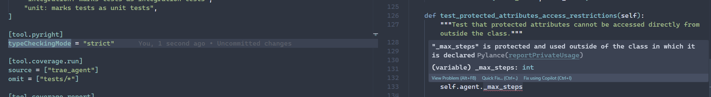

Encapsulation in Python is one of those topics that often gets brushed off,  either as unnecessary boilerplate or as baggage from statically typed languages like Java and C++. In many Python teams, it’s treated as optional, or worse, irrelevant.

But this casual attitude has a cost.

As Python takes on a bigger role in enterprise software, especially with the rise of AI, more teams are building larger, more complex systems together. Without proper encapsulation, internal changes in one part of the codebase can leak out and break things for everyone else. It becomes harder to reason about code boundaries, harder to collaborate, and harder to move fast without stepping on each other’s toes.

In this post, we’ll talk about **why encapsulation still matters in Python**, why it’s becoming increasingly important, and how to approach it in a way that actually fits the language and its philosophy.

And just in case you’re wondering: **no, this won’t be one of those "here’s how to mimic Java’s access modifiers in Python" posts.** We're going deeper than that.

<!--truncate-->

## **Access Modifiers: What They Are, and What They Look Like**

When people think of encapsulation, they often jump straight to **access modifiers**, and it’s easy to see why. In many languages, access modifiers are the main way to draw boundaries between internal and external code.

In Java, for example, you have explicit keywords:
```java

public class UserService {
    protected UserRepository repository;

    public void register(User user) {
        // ...
    }
}
```

Here, `protected` means no one outside the class(and its subclasses) can touch `repository`, and `public` means anyone can call `register`.

> `protected` is less strict in java, other classes **in the same package** can access protected member as well.

Python takes a different approach, instead of forcing strict access modifiers at interpreter level, it relies on naming conventions:

```python
class UserService:
    def __init__(self, repo: UserRepository):
        self._repository = repo

    def register(self, user: UserInfo):
        ...
```

In this example, the leading underscore in `_repository` is Python’s way of saying “hey, this is internal,  don’t mess with it.” But it’s just a convention. You _can_ still access it from the outside. If your type checker is configured correctly, it might warn you, but nothing at the interpreter level will stop you. No exceptions will be raised.


### **Why Do We Need Encapsulation?**

The primary reason is simple: **to draw a line between what's internal and what's public**. That line lets other developers,  or even future-you,  know what’s safe to rely on and what isn’t. When a method or attribute is marked internal (e.g. with a leading underscore), you're saying: _this is part of the implementation, not the interface._

Why does that matter? Because once other parts of the codebase,  or worse, external systems,  start depending on your internal details, **you lose the freedom to change them**. If you need to refactor, simplify, or remove something, you risk breaking unknown callers.

This is not a new problem. Software engineering has wrestled with this for decades, and the solution has been expressed through principles like the **Open/Closed Principle (OCP)**:

> _Software entities should be open for extension but closed for modification._

Encapsulation supports this by letting you change how things work internally, **without changing the parts others depend on**. When we design a class with a clear public interface and hidden internals, we make it easier to evolve the code over time without introducing regressions.

When we _do_ need to expose something, we can still preserve encapsulation using tools like `@property`. This lets us provide a stable public interface, while keeping the flexibility to change how things work behind the scenes,  coercing types, adding guards, lazy-loading data, etc.

In general, when a class represents business logic, it’s often a good idea to **default to making members protected** and **only expose public methods that represent meaningful, validated operations**.

Take this example:

```python
@dataclass
class UserInfo:
    email: str
    name: str
    role: str = "user"

class UserService:
    def __init__(self, user_repo: UserRepository):
        self._repo = user_repo

    def register(self, user: UserInfo):
        self._validate_email(user.email)
        self._validate_role(user.role)
        self._repo.add_user(user)

    def _validate_email(self, email: str): ...
    def _validate_role(self, role: str): ...
```

Here, we don't want other services to call `_validate_email` or `_repo.add_user()` directly. Those are internal details that can change. What we _do_ want them to use is the stable `register()` interface.

### **What Happens Without It?**

Now let’s imagine we didn’t bother with any of this,  we just exposed everything.

```python
# Somewhere else in the codebase
service = UserService()
user = UserProfile(email="a@example.com", name="Alice")
service.repository.add_user(user)  # Uh-oh
```

Other parts of the system might start calling `user_repo.add_user()` directly, bypassing all the validation logic in `UserService.register()`. That could lead to subtle, inconsistent behavior, or worse,  bad data getting into your system.

Or maybe someone starts reusing `_validate_email()` from somewhere else. But since it was never meant to be used externally, one day we remove it during a refactor,  and now their code breaks. Whose fault is it? Technically not yours, but it sure won't feel that way when you’re on the hook for fixing it.

When everything is public, **every change becomes dangerous**. Before touching anything, you have to check who’s using it. Modify a method? Now you’re spelunking through half the codebase, updating every dependent. It’s a maintenance nightmare.

Encapsulation reduces that cognitive load. It tells you what you can change freely and what you need to be careful with. It gives your code **safe zones**.

### **Why We Didn’t Need It as Much Before**

So why hasn’t this been a bigger issue in Python until now?

For a long time, many people use Python for small-scale projects, things like automation scripts, scientific prototypes, academic experiments, or exploratory data work. In those contexts, it didn’t really matter if internals were exposed, because the same person was writing, reading, and maintaining the entire codebase.

However, over the past decade, Python has steadily grown into a first-class language for building AI, data heavy systems. The rise of web frameworks like Django and FastAPI, the explosion of machine learning libraries like TensorFlow and PyTorch, and the growth of async tooling and cloud-native workflows have all made Python a serious player in enterprise software development.

Also, before Python 3.6, we simply didn’t have the tools to enforce encapsulation effectively. Without type hints and the ecosystem around them, it was hard to even notice violations of protected members, let alone prevent them. Now, with tools like pyright, mypy, and IDEs like VSCode, we can catch those violations early.



- Example vscode config from lihil

    ```toml
    [tool.pyright]
    exclude = ["tests"]
    include = ["lihil/*.py"]
    python_version = "3.10"
    typeCheckingMode = "strict"
    ```

## when to use access modifier and when not to

Not all classes are created equal. Their purpose affects how much encapsulation you really need,  and what kind.

Let’s take two common categories: **data classes** and **service classes**.

Data classes are meant to carry state. But sometimes we start stuffing behavior and dependencies into them,  and that’s when things get messy. Consider this example:

```python
@dataclass
class UserManager:
    users: list[UserInfo]
    engine: AsyncEngine  # external dependency

    def add_user(self, user_info: UserInfo):
        ...
```

At first glance, this looks fine. But `engine` is not really just data,  it’s a dependency. It probably shouldn't be public, but because this is a dataclass, _everything is public by default_. You don’t get any real control over what’s exposed, which can lead to tight coupling and leaky abstractions.

Now let’s flip the problem: a service class with too many internal configuration values.

```python
class FileDownloader:
    def __init__(self, session: ClientSession):
        self._session = session
        self._max_concurrent = 3
        self._max_file_size = 100 * 1024 * 1024
        self._timeout = 10
        self._retries = 2
        self._allow_redirect = True
        # and the list goes on...

    def download(self, url: str):
        ...
```

Each of these config values might need to be accessed from outside the class, but none of them are really _business logic_. So now you're stuck adding five `@property` methods just to make them selectively public. That's tedious and clutters the class with boilerplate.

A better approach? Extract the config into a separate dataclass:

```python
@dataclass
class DownloadConfig:
    max_concurrent: int = 3
    max_file_size: int = 100 * 1024 * 1024
    timeout: int = 10
    retries: int = 2
    allow_redirect: bool = True

class FileDownloader:
    def __init__(self, session: ClientSession, config: DownloadConfig):
        self._session = session
        self._config = config

    @property
    def config(self) -> DownloadConfig:
        return self._config
```

Now the `FileDownloader` focuses on behavior, and the data lives in a plain, easy-to-inspect structure. No clutter. No second-guessing access modifiers.

If you mix state and behavior carelessly, encapsulation decisions get exhausting,  you’ll find yourself manually evaluating every attribute and method. But when the design is clear, the modifiers fall into place naturally.

### Anti-patterns


The worst-case scenario is blindly adding getters and setters for everything,  especially when they don’t do anything useful. If you’re not doing validation, type coercion, or state transformation, a setter is just noise.

Let’s look at an example:

```python
class Project:
    def __init__(self, status: str):
        self._status = status

	@property
    def status(self) -> str: return self._status

	@status.setter
    def status(self, status: str): self._status = status
```

What value does this add? The methods don’t protect anything. They don’t clarify intent. They just waste space and give a false sense of encapsulation.

Now compare that to this alternative:

```python
class Project:
    def __init__(self, status: str):
        self._status = status

    def mark_as_completed(self, reason: str | None = None):
        """Mark the project as completed, with an optional reason for tracking."""
        if self._status == "comleted":
	        return
		if self._status not in ("started", "running"):
		    raise InvalidStatusError(self._status)

        self._status = "completed"
        if reason:
            self._log_reason(reason)
```

This version is doing real work. You can pass multiple arguments. The method names express intent. The docstrings help the reader understand context. It’s much more maintainable and far less dogmatic.

And while we’re at it: don’t abuse **inheritance** either. You can spend all day trying to protect internals from subclasses,  or you can just stop subclassing altogether.

Sometimes the simpler answer is to design your class as effectively **final**, and let other classes **depend on it via composition**. You avoid the pitfalls of fragile base classes, and you make encapsulation easier to reason about.

Yes, _composition over inheritance_. Not always. But definitely more often than some legacy tutorials would have you believe.


### **Encapsulation Beyond Classes**

Encapsulation isn’t just about hiding attributes inside a class. The same principle applies at higher levels,  **modules**, **packages**, and even **entire applications**. It's all about controlling what gets exposed and what stays internal.

Let’s look at a few examples.

### Python (Module-Level)

```python
# token_service/__init__.py 

from .service import TokenService  
__all__ = ["TokenService"]  # Everything else stays internal
```

You can also use leading underscores for private helpers:

```python
# token_service/utils.py 
def _sign_payload(...): ...
```


This tells both humans and tools: "this isn’t part of the public interface."

### TypeScript (File/Module-Level)

```ts
// token_service.ts

export class TokenService {}       // public
class InternalCache {}             // not exported = internal to the module
```
If it’s not exported, it’s not part of the API. That’s module-level encapsulation.

---

And you can scale this even further.

- At the **package level**, you decide which modules to expose in `__init__.py` or in your `pyproject.toml`.
- At the **application level**, you expose only selected routes in your web API or specific commands in your CLI. Everything else stays behind the scenes.


## Encapsulation beyond code

Encapsulation doesn’t stop at classes, functions, or modules, it applies at the **architectural level**, too.

In a microservice-based system, each service is an isolated unit with its own data, logic, and internal state. You don’t (and shouldn’t) reach across service boundaries to query another service’s database or call its internal methods. Instead, communication happens through **well-defined interfaces**, usually REST, gRPC, or message queues.

This is encapsulation at the system level:

- A service only exposes the API endpoints it wants others to use.
- Internal components like DAOs, caches, feature flags, or job queues are entirely hidden.
- Breaking changes can be avoided because external consumers never depend on internal details.

A good example would be an **API Gateway**. To the caller, it stays transparent. But behind the scenes, the gateway might route the request to multiple services, apply authentication, logging, retries, or circuit-breaking logic. None of that is exposed. The caller doesn't know, and doesn't need to.

It’s the same idea as `private` or `protected`, just scaled out over a network.

Whether you’re defining a Python method, a Go module, or a service boundary in your infrastructure, the principle is the same:

> **Hide internal details. Expose a clean, intentional interface. Decouple everything else.**


### **Wrapping Up**

Encapsulation isn’t about following rules,  it’s about creating **boundaries that protect your code**. Whether you’re building a Python library, designing a class, organizing a module, or architecting an entire system, the goal is the same: **make the interface clear, keep the internals private, and give yourself room to evolve**.

In Python, we don’t have enforced access modifiers,  and that’s fine. We have conventions, type checkers, and design discipline. What matters is that you _use them deliberately_.

Don’t add encapsulation for its it-tooown sake. But don’t dismiss it just because you’re writing Python. If anything, Python’s flexibility makes it _more_ important to clearly mark your boundaries.

Start by separating your data classes from your service classes. Use underscores to guide intention. Avoid meaningless setters. Prefer real methods with real names. And think in terms of public interfaces,  whether you're building a class or an entire API.

