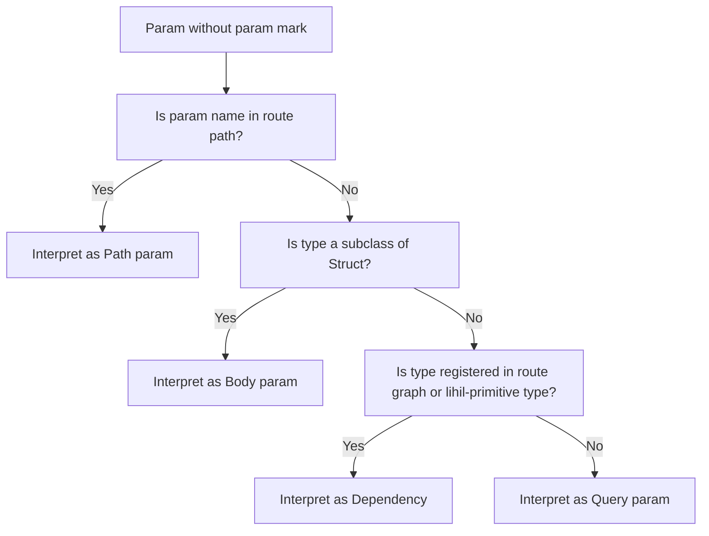

# endpoint

An `endpoint` is the most atomic ASGI component in `lihil` that defines how clients interact with the resource exposed by the `Route`.

<!-- In the [ASGI callchain](./minicourse.md) the `endpoint` is typically at the end. -->

### Param Parsing

```python
from lihil import use, Ignore
from typing import Annotated, NewType
from sqlalchemy.ext.asyncio import AsyncConnection, AsyncEngine

async def get_conn(engine: AsyncEngine) -> AsyncConnection:
    async with engine.begin() as conn:
        yield conn

UserID = NewType("UserID", str)

def user_id_factory() -> UserID:
    return UserID(str(uuid4()))

async def create_user(
    user: UserData, user_id: UserID, conn: AsyncConnection
) -> Annotated[UserDB, stauts.Created]:

    sql = user_sql(user=user, id_=user_id)
    await conn.execute(sql)
    return UserDB.from_user(user, id=user_id)

users_route.factory(get_conn)
users_route.factory(user_id_factory, reuse=False)
```

Here,

1. `user_id` will be created by `user_id_factory` and return a uuid in str.
2. `conn` will be created by `get_conn` and return an instance of `AsyncConnection`, where the the connection will be returned to engine after request.
3. `UserDB` will be json-serialized, and return a response with content-type being `application/json`, status code being `201`.

### Explicitly declare a Param

Explicitly declaring a parameter with `Param` tells Lihil to treat it as-is, without further analysis.

**Example**:

```python
async def login(cred: Annotated[str, Param("header", alias="User-Credentials")], x_access_token: Annotated[str, Param("header")]) : ...
```

- Here param `cred` expects a header with key `User-Credentials`.

- If key not provided, The kebab case of param name is used, for example, here `x_access_token` expects a header with key `x-access-token`

#### Implicitly declare a Param

If a param is not declared with any param mark, the following rule would apply to parse it:

- If the param name appears in route path, it is interpreted as a path param.
- If the param type is a subclass of `msgspec.Struct`, it is interpreted as a body param.
- If the param type is registered in the route graph, or is a lihil-primitive type, it will be interpered as a dependency and will be resolved by lihil

- Otherise, it is interpreted as a query param.



Example:

```python
from typing import Annotated
from lihil import Route, Payload, use, EventBus

user_route = Route("/users/{user_id}")

class UserUpdate(Payload): ...
class Engine: ...
class Cache: ...

user_route.factory(Cache)

@user_route.put
async def update_user(user_id: str, engine: Annotated[Engine, use(Engine)], cache: Cache, bus: EventBus):
    return "ok"
```

In this example:

- `user_id` appears in the route path, so it is a path param
- `engine` is annotated with the `Use` mark, so it is a dependency
- `cache` is registered in the user_route, so it is also a dependency
- `bus` is a lihil-builtin type, it is therefore a dependency as well.

Only `user_id` needs to be provided by the client request, rest will be resolved by lihil.

Since return param is not declared, `"ok"` will be serialized as json `'"ok"'`, status code will be `200`.

### Data validation

lihil provide you data validation functionalities out of the box using msgspec.

### Constraints

- You might combine `typing.Annotated` and `Param` to put constraints on params,

```python
from lihil import Param
all_users = Route("/users")

@all_users.get
async def get_users(numers: Annotated[int, Param(gt=0)]):
    ...
```

Here `get_user` expects a query param `numers`, an integer with value greater than `0`.

- Constraints with structual data

```python
from typing import Annotated

from lihil import Payload, Param

UnixName = Annotated[
    str, Param(min_length=1, max_length=32, pattern="^[a-z_][a-z0-9_-]*$")
]

class User(Payload):
    name: UnixName
    groups: Annotated[set[UnixName], Param(max_length=16)] = set()
    cpu_limit: Annotated[float, Param(ge=0.1, le=8)] = 1
    mem_limit: Annotated[int, Param(ge=256, le=8192)] = 1024

@all_users.post
async def create_user(user: User): ...
```

Here `create_user` expects a body param `user`, a structual data where each field has constraints.

- Constraints with supported types

Checkout [msgspec constraints](https://jcristharif.com/msgspec/constraints.html) for more details on specific constraints that you can set on different types.

### Return Marks

Often you would like to change the status code, or content type of your endpoint, to do so, you can use one or a combination of several `return marks`. for example, to change stauts code:

```python
from lihil import Annotated, status

async def create_user(user: UserData, engine: Engine) -> Annotated[UserDB, status.Created]:
    ...
```

Now `create_user` would return a status code `201`, instead of the default `200`.

There are several return marks you might want to use:

| Return Mark | Purpose                                                  | Type Argument(s)        | Notes                                | Example           |
| ----------- | -------------------------------------------------------- | ----------------------- | ------------------------------------ | ----------------- |
| `Json[T]`   | Response with `application/json` content type            | `T`: response body type | Default return type if not specified | `Json[list[int]]` |
| `Stream[T]` | Server-sent events with `text/event-stream` content type | `T`: event data type    | For event streaming                  | `Stream[str]`     |
| `Text`      | Plain text response with `text/plain` content type       | None                    | Use for simple text responses        | `Text`            |
| `HTML`      | HTML response with `text/html` content type              | None                    | Use for HTML content                 | `HTML`            |
| `Empty`     | Empty response (no body)                                 | None                    | Indicates no content to return       | `Empty`           |

**Example**:

```python
from lihil import Json

async def demo() -> Json[list[int]]: ...
```

return marks have no runtime/typing effect outside of lihil, your type checker would treat `Json[T]` as `T`.

#### Response with status code

- `Annotated[T, status.OK]` for response with status code `200`. where `T` can be anything json serializable, or another return mark.

For instance, in the `create_user` example, we use `Annotated[UserDB, status.Created]` to declare our return type, here `T` is `UserDB`.

- By default, the return convert is json-serialized, so that it is equiavlent to `Annotated[Json[UserDB], status.Created]`.
- If you would like to return a response with content type `text/html`, you might use `HTML`

```python
async def hello() -> HTML:
    return "<p>hello, world!</p>"
```

#### Return Union

it is valid to return union of multiple types, they will be shown as `anyOf` schemas in the open api specification.

```python
async def create_user() -> User | TemporaryUser: ...
```

#### Custom Encoder/Decoder

You can also use your own customized encoder/decoder for request params and function return.
To use them, annotate your param type with `CustomDecoder` and your return type with `CustomEncoder`

```python
from lihil.di import CustomEncoder, CustomDecoder

user_route = Route(/users/{user_id})

@user_route
async def get_user(
    user_id: Annotated[str, CustomDecoder(decode_user_id)]
) -> Annotated[str, CustomEncoder(encode_user_id)]:
    return user_id
```

```python
def decoder[T](param: str | bytes) -> T: ...
```

- `decoder` should expect a single param with type either `str`, for non-body param, or `bytes`, for body param, and returns required param type, in the `decode_user_id` case, it is `str`.

```python
def encoder[T](param: T) -> bytes: ...
```

- `encoder` should expect a single param with any type that the endpoint function returns, in the `encode_user_id` case, it is `str`, and returns bytes.

### Properties

- Endpoint can have these properties:

```python title="lihil.routing"

class IEndpointProps(TypedDict, total=False):
    errors: Sequence[type[DetailBase[Any]]] | type[DetailBase[Any]]
    "Errors that might be raised from the current `endpoint`. These will be treated as responses and displayed in OpenAPI documentation."
    in_schema: bool
    "Whether to include this endpoint inside openapi docs, default to True"
    to_thread: bool
    "Whether this endpoint should be run wihtin a separate thread, only apply to sync function"
    scoped: Literal[True] | None
    "Whether current endpoint should be scoped, default to None"
    auth_scheme: AuthBase | None
    "Auth Scheme for access control, default to None"
    tags: Sequence[str] | None
    "OAS tag, endpoints with the same tag will be grouped together, default to route tag"
    plugins: list[IPlugin]
    "Decorators to decorate the endpoint function"
```

    - `scoped`: if an endpoint requires any dependency that is an async context manager, or its factory returns an async generator, the endpoint would be scoped, and setting scoped to None won't change that, however, for an endpoint that is not scoped, setting `scoped=True` would make it scoped.

### Override endpoint properties

You can alter endpoint properties by changing them in route decorator.

```python
@router.get(errors=[UserNotFoundError, UserInactiveError])
async get_user(user_id: str): ...
```

### Provide a properties for every endpoint in the route:

You might provide default properties when intialize a route,

```python
from lihil.routing import Route, EndpointProps

default_props = EndpointProps(errors=[UserNotFoundError, UserInactiveError])
prop_route = Route(props=default_props)
```

- Here `default_props` would be applied to every endpoint added to `prop_route`.
- endpoint properties provided via route decorator like `route.get` would override roperties provided by route.
