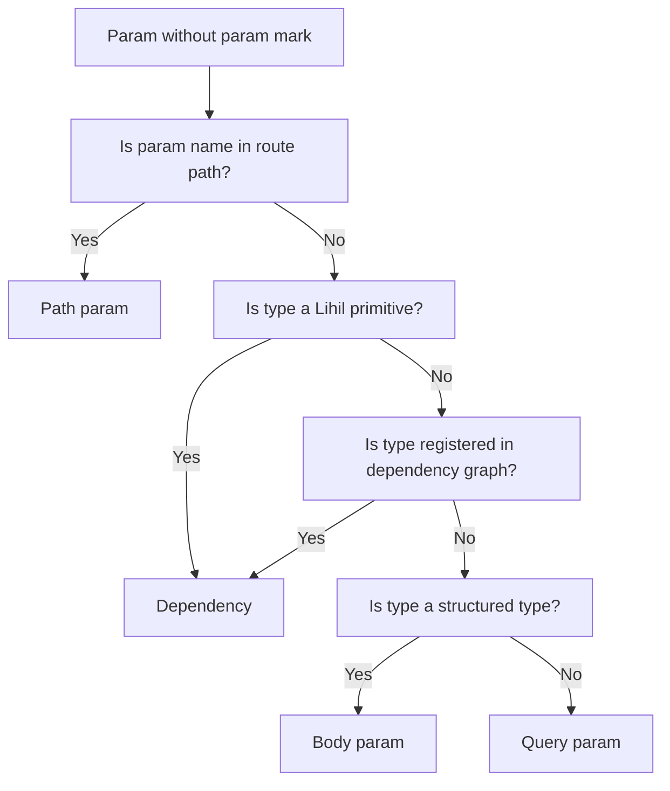

# endpoint

An `endpoint` is the most atomic ASGI component in `lihil` that defines how clients interact with the resource exposed by the `Route`.

<!-- In the [ASGI callchain](./minicourse.md) the `endpoint` is typically at the end. -->

### Param Parsing

```python
from lihil import Route
from ididi import NodeConfig
from typing import Annotated, NewType
from sqlalchemy.ext.asyncio import AsyncConnection, AsyncEngine


async def get_conn(engine: AsyncEngine) -> AsyncConnection:
    async with engine.begin() as conn:
        yield conn

UserID = NewType("UserID", str)

def user_id_factory() -> UserID:
    return UserID(str(uuid4()))

user_route = Route("/users", deps=[get_conn, (user_id_factory, NodeConfig(reuse=False))])

@user_route.post
async def create_user(
    user: UserData, user_id: UserID, conn: AsyncConnection
) -> Annotated[UserDB, stauts.Created]:

    sql = user_sql(user=user, id_=user_id)
    await conn.execute(sql)
    return UserDB.from_user(user, id=user_id)
```

Here,

1. `user_id` will be created by `user_id_factory` and return a uuid in str.
2. `conn` will be created by `get_conn` and return an instance of `AsyncConnection`, where the the connection will be returned to engine after request.
3. `UserDB` will be json-serialized, and return a response with content-type being `application/json`, status code being `201`.

### Explicitly declare a Param

Explicitly declaring a parameter with `Param` tells Lihil to treat it as-is, without further analysis.

**Example**:

```python
async def login(cred: Annotated[str, Param("header", alias="User-Credentials")], x_access_token: Annotated[str, Param("header")]) : ...
```

- Here param `cred` expects a header with key `User-Credentials`.

- If key not provided, The kebab case of param name is used, for example, here `x_access_token` expects a header with key `x-access-token`

#### Implicitly declare a Param

If a param is not declared with any param mark, the following rule would apply to parse it:

- If the param name appears in the route path, it is interpreted as a path param.
- If the param type is a Lihil primitive (e.g., `Request`, `WebSocket`, `Resolver`), it is treated as a framework-provided dependency.
- If the param type is registered in the dependency graph (e.g., provided via `Route(..., deps=[...])`), it is resolved via dependency injection.
- If the param type is a structured type (e.g., `msgspec.Struct`, `pydantic.BaseModel`, `lihil.Payload`, `dataclass`), it is interpreted as a body param.
- Otherise, it is interpreted as a query param.


```mermaid
flowchart TD
    A[Param without param mark] --> B[Is param name in route path?]
    B -- Yes --> P[Path param]
    B -- No --> C[Is type a Lihil primitive?]
    C -- Yes --> S[Dependency]
    C -- No --> D[Is type registered in dependency graph?]
    D -- Yes --> S[Dependency]
    D -- No --> E[Is type a structured type?]
    E -- Yes --> R[Body param]
    E -- No --> Q[Query param]
```

Note: "structured type" includes subclasses of `abc.Mapping` (dict-like), `msgspec.Struct`, Pydantic models, `TypedDict`, and `dataclass` types.

Example:

```python
from typing import Annotated
from lihil import Route, Payload

user_route = Route("/users/{user_id}", deps=[Cache, Engine])

class UserUpdate(Payload): ...
class Engine: ...
class Cache: ...


@user_route.put
async def update_user(user_id: str, engine: Engine, cache: Cache):
    return "ok"
```

In this example:

- `user_id` appears in the route path, so it is a path param
- `engine` is annotated with the `Use` mark, so it is a dependency
- `cache` is registered in the user_route, so it is also a dependency

Only `user_id` needs to be provided by the client request, rest will be resolved by lihil.

Since return param is not declared, `"ok"` will be serialized as json `'"ok"'`, status code will be `200`.

### Data validation

lihil provide you data validation functionalities out of the box using msgspec.

### Constraints

- You might combine `typing.Annotated` and `Param` to put constraints on params,

```python
from lihil import Param
all_users = Route("/users")

@all_users.get
async def get_users(numers: Annotated[int, Param(gt=0)]):
    ...
```

Here `get_user` expects a query param `numers`, an integer with value greater than `0`.

- Constraints with structual data

```python
from typing import Annotated

from lihil import Payload, Param

UnixName = Annotated[
    str, Param(min_length=1, max_length=32, pattern="^[a-z_][a-z0-9_-]*$")
]

class User(Payload):
    name: UnixName
    groups: Annotated[set[UnixName], Param(max_length=16)] = set()
    cpu_limit: Annotated[float, Param(ge=0.1, le=8)] = 1
    mem_limit: Annotated[int, Param(ge=256, le=8192)] = 1024

@all_users.post
async def create_user(user: User): ...
```

Here `create_user` expects a body param `user`, a structual data where each field has constraints.

- Constraints with supported types

Checkout [msgspec constraints](https://jcristharif.com/msgspec/constraints.html) for more details on specific constraints that you can set on different types.

### Response

For return types, status codes, return marks, unions, and custom encoders/decoders, see [Response](./response.md).

### Properties

- Endpoint can have these properties:

```python title="lihil.routing"

class IEndpointProps(TypedDict, total=False):
    errors: Sequence[type[DetailBase[Any]]] | type[DetailBase[Any]]
    "Errors that might be raised from the current `endpoint`. These will be treated as responses and displayed in OpenAPI documentation."
    in_schema: bool
    "Whether to include this endpoint inside openapi docs, default to True"
    to_thread: bool
    "Whether this endpoint should be run wihtin a separate thread, only apply to sync function"
    scoped: Literal[True] | None
    "Whether current endpoint should be scoped, default to None"
    auth_scheme: AuthBase | None
    "Auth Scheme for access control, default to None"
    tags: Sequence[str] | None
    "OAS tag, endpoints with the same tag will be grouped together, default to route tag"
    plugins: list[IPlugin]
    "Decorators to decorate the endpoint function"
    deps: list[DepNode] | None
    "Dependencies that might be used in "
```

    - `scoped`: if an endpoint requires any dependency that is an async context manager, or its factory returns an async generator, the endpoint would be scoped, and setting scoped to None won't change that, however, for an endpoint that is not scoped, setting `scoped=True` would make it scoped.

### Override endpoint properties

You can alter endpoint properties by changing them in route decorator.

```python
@router.get(errors=[UserNotFoundError, UserInactiveError])
async get_user(user_id: str): ...
```

### Provide a properties for every endpoint in the route:

You might provide default properties when intialize a route,

```python
from lihil.routing import Route, EndpointProps

default_props = EndpointProps(errors=[UserNotFoundError, UserInactiveError])
prop_route = Route(props=default_props)
```

- Here `default_props` would be applied to every endpoint added to `prop_route`.
- endpoint properties provided via route decorator like `route.get` would override roperties provided by route.
