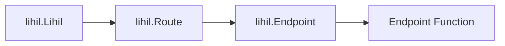

# ミニコース

チュートリアルをより良く理解するのに役立つWeb開発に関連する一般的な概念について学習します。

## `Resource` リソース

### URLを介してアクセスできる識別可能な`エンティティ`

考えすぎないでください。`resource`という用語が気に入らない場合は、`object`として考えてください。

## `Entity` エンティティ

一意に識別できるもの。例えば

```python
from dataclasses import dataclass, field
from uuid import uuid4

class User:
    user_id: str = field(default_factory=lambda: str(uuid4()))
```

ここで、`User`は`user_id`を通じて一意に識別できるためエンティティです。
つまり、任意の2つの`User`インスタンス`u1`と`u2`について、`u1.user_id` == `u2.user_id`なら`u1 == u2`です。

## `URI`

### Uniform Resource Identifier

リソースを一意に識別する文字列。URIはURL、URN、またはその両方です。URLは次の形式に従います：

> `protocol://domain/path?query#fragment`

`#fragment`は通常クライアントサイドナビゲーションに使用され、サーバーサイドアプリケーションを作成する際には通常必要ありません。

例：

`https://myhost.com/users/lhl/orders?nums=3`

このようなRESTful API URIを見ると、事前知識がなくても以下を推測できます：

- これは`https`プロトコルを使用して`myhost.com`でホストされているWebサイトです。
- 特定のユーザー`lhl`に属する`orders`という名前のリソースにアクセスしています。
- クエリパラメータ`nums`が含まれており、値は`3`です。

`URL`（Uniform Resource Locator）：リソースを識別するだけでなく、そのアクセス方法も提供するURIの一種。URLは一般的にスキーム（プロトコル）、ドメイン、パス、クエリパラメータ、およびオプションでフラグメントを含みます。


## `ASGI`

ASGIは`Asynchronous Server Gateway Interface`を指し、`encode`によって設計されたプロトコルです。


## `ASGIApp`

次のシグネチャを持つ非同期呼び出し可能オブジェクトです。

```python
class ASGIApp(Protocol):
    async def __call__(self, scope, receive, send) -> None: ...
```

ここで

- `scope`は変更可能なマッピング、多くの場合`dict`です。
- `receive`はパラメータなしで`message`を返す非同期呼び出し可能オブジェクト
- `message`も変更可能なマッピング、多くの場合`dict`です。
- `send`は単一のパラメータ`message`を受け取り`None`を返す非同期呼び出し可能オブジェクト

`lihil`から見る多くのコンポーネントは`ASGIApp`を実装しており、以下が含まれます

- `Lihil`
- `Route`
- `Endpoint`
- `Response`

ASGIミドルウェアも`ASGIApp`です。


### `ASGI呼び出しチェーン`

`ASGIApp`は通常、連結リストのように連鎖され（`責任の連鎖`パターンとして認識されるかもしれません）、チェーンへの各呼び出しはチェーン上のすべてのノードを通過します。例えば、通常の呼び出しスタックは次のようになります



- `Endpoint Function`は`Route.{http method}`で登録した関数、例えば`Route.get`

- uvicornなどのASGIサーバーでlihilを提供する場合、`lihil.Lihil`はuvicornによって呼び出されます。


## 制御の反転 & 依存性注入

### 制御の反転

`制御の反転`という用語は異国的で派手に聞こえるかもしれませんし、ソフトウェア設計の異なるレベルで解釈できますが、ここではその狭義の意味の1つだけについて話します。

データベースでユーザーを作成するモジュールを書いていると想像してください。次のようなものがあるかもしれません：

```python
from sqlalchemy.ext.asyncio import create_engine, AsyncEngine

class Repo:
    def __init__(self, engine: AsyncEngine):
        self.engine = engine

    async def add_user(self, user: User):
        prepared_stmt = sle.prepare_add_user(user)
        async with self.engine.connct() as conn:
            await conn.execute(prepared_stmt)

async def create_user(user: User, repo: Repository):
    await repo.add_user(user)

async def main():
    engine = create_engine(url=url)
    repo = Repo(engine)
    user = User(name="user")
    await create_user(user, repo)
```

ここで、`main.py`内の`main`関数から`create_user`を呼び出しています。`python -m myproject.main`を実行すると、関数`main`と`create_user`が呼び出されます。

lihilでやることと比較してみましょう：

```python
users_route = Route("/users")

@users_route.post
async def create_user(user: User, repo: Repository):
    await repo.add_user(user)

lhl = Lihil(user_route)
```

ここで注意してください。あなたが関数から積極的に`create_user`を呼び出すのではなく、リクエストが到着時にlihilがあなたの関数を呼び出し、`create_user`の依存関係はlihilによって管理・注入されます。

これは`制御の反転`の例であり、lihilが専用の依存性注入ツール`ididi`を使用する主な理由の1つでもあります。

### エンドポイント関数内で依存関係を手動構築することとの比較

エンドポイント関数内で依存関係を自分で構築しない理由を疑問に思うかもしれません。

```python
@users_route.post
async def create_user(user: User):
    engine = create_engine(url=url)
    repo = Repo(engine)
    await repo.add_user(user)
```

`Repo`を`create_user`に動的に注入していないため、以下の利点を失います：

- インターフェースと実装の分離：
    1. しばしば、アプリをデプロイする環境に応じて異なる方法でエンジンを構築したいことがあります。例えば、本番環境では接続プールのサイズを増やしたいかもしれません。
    2. テスト中は実際のクエリを実行しないため、`Engine`オブジェクトをモックする必要があります。
    3. ビジネスニーズに対応するために新しい`AdvancedEngine(Engine)`を作成しても、内部コードを変更せずに`create_user`に使わせることはできません。

- ライフタイム制御：
    依存関係には異なるライフタイムがあります。例えば、
    異なるリクエスト間で同じ`AsyncEngine`を再利用したいが、各リクエストを処理するために新しい`AsyncConnection`を開きたい場合があります。