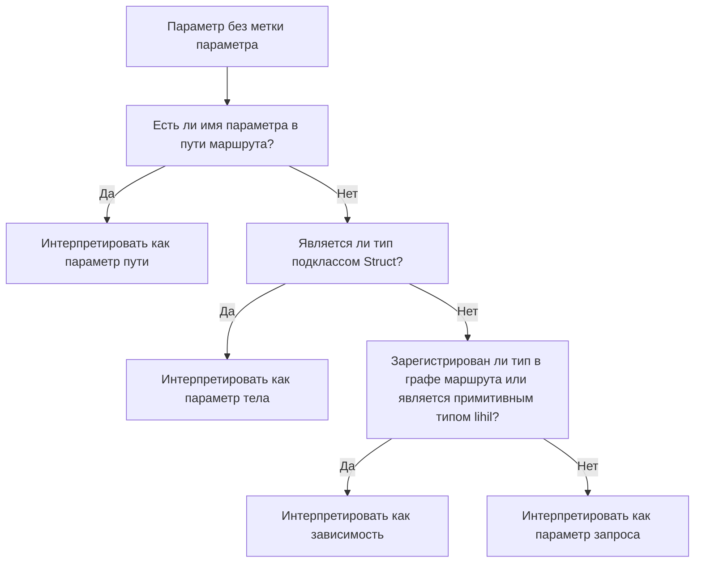

# endpoint

`endpoint` — это самый атомарный ASGI-компонент в `lihil`, который определяет, как клиенты взаимодействуют с ресурсом, предоставляемым `Route`.

<!-- В [цепочке вызовов ASGI](./minicourse.md) `endpoint` обычно находится в конце. -->

### Парсинг параметров

```python
from lihil import Route
from ididi import NodeConfig
from typing import Annotated, NewType
from sqlalchemy.ext.asyncio import AsyncConnection, AsyncEngine


async def get_conn(engine: AsyncEngine) -> AsyncConnection:
    async with engine.begin() as conn:
        yield conn

UserID = NewType("UserID", str)

def user_id_factory() -> UserID:
    return UserID(str(uuid4()))

user_route = Route("/users", deps=[get_conn, (user_id_factory, NodeConfig(reuse=False))])

@user_route.post
async def create_user(
    user: UserData, user_id: UserID, conn: AsyncConnection
) -> Annotated[UserDB, stauts.Created]:

    sql = user_sql(user=user, id_=user_id)
    await conn.execute(sql)
    return UserDB.from_user(user, id=user_id)
```

Здесь:

1. `user_id` будет создан с помощью `user_id_factory` и вернет uuid в виде строки.
2. `conn` будет создан с помощью `get_conn` и вернет экземпляр `AsyncConnection`, где соединение будет возвращено движку после запроса.
3. `UserDB` будет сериализован в JSON и вернет ответ с content-type `application/json` и статус-кодом `201`.

### Явное объявление параметра

Явное объявление параметра с помощью `Param` указывает Lihil обрабатывать его как есть, без дальнейшего анализа.

**Пример**:

```python
async def login(cred: Annotated[str, Param("header", alias="User-Credentials")], x_access_token: Annotated[str, Param("header")]) : ...
```

- Здесь параметр `cred` ожидает заголовок с ключом `User-Credentials`.

- Если ключ не предоставлен, используется kebab case имени параметра, например, здесь `x_access_token` ожидает заголовок с ключом `x-access-token`

#### Неявное объявление параметра

Если параметр не объявлен с какой-либо меткой параметра, для его парсинга применяются следующие правила:

- Если имя параметра появляется в пути маршрута, оно интерпретируется как параметр пути.
- Если тип параметра является подклассом `msgspec.Struct`, он интерпретируется как параметр тела.
- Если тип параметра зарегистрирован в графе маршрута или является примитивным типом lihil, он будет интерпретирован как зависимость и будет разрешен lihil

- В противном случае он интерпретируется как параметр запроса.



Пример:

```python
from typing import Annotated
from lihil import Route, Payload

user_route = Route("/users/{user_id}", deps=[Cache, Engine])

class UserUpdate(Payload): ...
class Engine: ...
class Cache: ...


@user_route.put
async def update_user(user_id: str, engine: Engine, cache: Cache):
    return "ok"
```

В этом примере:

- `user_id` появляется в пути маршрута, поэтому это параметр пути
- `engine` аннотирован меткой `Use`, поэтому это зависимость
- `cache` зарегистрирован в user_route, поэтому это также зависимость

Только `user_id` должен быть предоставлен клиентским запросом, остальное будет разрешено lihil.

Поскольку возвращаемый параметр не объявлен, `"ok"` будет сериализован как json `'"ok"'`, статус-код будет `200`.

### Валидация данных

lihil предоставляет функциональность валидации данных из коробки, используя msgspec.

### Ограничения

- Вы можете комбинировать `typing.Annotated` и `Param` для наложения ограничений на параметры:

```python
from lihil import Param
all_users = Route("/users")

@all_users.get
async def get_users(numers: Annotated[int, Param(gt=0)]):
    ...
```

Здесь `get_user` ожидает параметр запроса `numers`, целое число со значением больше `0`.

- Ограничения со структурными данными

```python
from typing import Annotated

from lihil import Payload, Param

UnixName = Annotated[
    str, Param(min_length=1, max_length=32, pattern="^[a-z_][a-z0-9_-]*$")
]

class User(Payload):
    name: UnixName
    groups: Annotated[set[UnixName], Param(max_length=16)] = set()
    cpu_limit: Annotated[float, Param(ge=0.1, le=8)] = 1
    mem_limit: Annotated[int, Param(ge=256, le=8192)] = 1024

@all_users.post
async def create_user(user: User): ...
```

Здесь `create_user` ожидает параметр тела `user`, структурные данные, где каждое поле имеет ограничения.

- Ограничения с поддерживаемыми типами

Ознакомьтесь с [ограничениями msgspec](https://jcristharif.com/msgspec/constraints.html) для получения более подробной информации о конкретных ограничениях, которые вы можете установить для разных типов.

### Метки возврата

Часто вы хотели бы изменить статус-код или тип содержимого вашего endpoint'а. Для этого вы можете использовать одну или комбинацию нескольких `меток возврата`. Например, чтобы изменить статус-код:

```python
from lihil import Annotated, status

async def create_user(user: UserData, engine: Engine) -> Annotated[UserDB, status.Created]:
    ...
```

Теперь `create_user` будет возвращать статус-код `201` вместо стандартного `200`.

Существует несколько меток возврата, которые вы можете использовать:

| Метка возврата | Назначение                                                     | Аргумент(ы) типа        | Примечания                             | Пример            |
| -------------- | -------------------------------------------------------------- | ----------------------- | -------------------------------------- | ----------------- |
| `Json[T]`      | Ответ с типом содержимого `application/json`                  | `T`: тип тела ответа    | Тип возврата по умолчанию, если не указан | `Json[list[int]]` |
| `Stream[T]`    | Server-sent events с типом содержимого `text/event-stream`     | `T`: тип данных события | Для потоковой передачи событий          | `Stream[str]`     |
| `Text`         | Ответ с обычным текстом и типом содержимого `text/plain`       | Нет                     | Использовать для простых текстовых ответов | `Text`            |
| `HTML`         | HTML-ответ с типом содержимого `text/html`                     | Нет                     | Использовать для HTML-содержимого      | `HTML`            |
| `Empty`        | Пустой ответ (без тела)                                       | Нет                     | Указывает на отсутствие содержимого для возврата | `Empty`           |

**Пример**:

```python
from lihil import Json

async def demo() -> Json[list[int]]: ...
```

метки возврата не имеют влияния на время выполнения/типизацию вне lihil, ваш средство проверки типов будет рассматривать `Json[T]` как `T`.

#### Ответ со статус-кодом

- `Annotated[T, status.OK]` для ответа со статус-кодом `200`, где `T` может быть чем угодно, что можно сериализовать в JSON, или другой меткой возврата.

Например, в примере `create_user` мы используем `Annotated[UserDB, status.Created]` для объявления нашего типа возврата, здесь `T` — это `UserDB`.

- По умолчанию возвращаемое значение сериализуется в JSON, так что это эквивалентно `Annotated[Json[UserDB], status.Created]`.
- Если вы хотите вернуть ответ с типом содержимого `text/html`, вы можете использовать `HTML`

```python
async def hello() -> HTML:
    return "<p>hello, world!</p>"
```

#### Объединение возвращаемых значений

Допустимо возвращать объединение нескольких типов, они будут показаны как схемы `anyOf` в спецификации open api.

```python
async def create_user() -> User | TemporaryUser: ...
```

#### Пользовательский кодировщик/декодировщик

Вы также можете использовать свой собственный кодировщик/декодировщик для параметров запроса и возврата функции.

```python
def encoder_user_id(user_id: UUID) -> bytes:
    return str(user_id)

def decoder_user_id(user_id: str) -> UUID:
    return UUID(user_id)

user_route = Route("/users/{user_id}")

@user_route(encoder=encode_user_id)
async def get_user(
    user_id: Annotated[UUID, Param(decoder=decode_user_id)]
) -> str:
    return user_id
```

```python
def decoder[T](param: str | bytes) -> T: ...
```

- `decoder` должен ожидать один параметр с типом либо `str` для параметра не-тела, либо `bytes` для параметра тела и возвращать требуемый тип параметра, в случае `decode_user_id` это `str`.

```python
def encoder[T](param: T) -> bytes: ...
```

- `encoder` должен ожидать один параметр любого типа, который возвращает функция endpoint'а, в случае `encode_user_id` это `str`, и возвращать bytes.

### Свойства

- Endpoint может иметь эти свойства:

```python title="lihil.routing"

class IEndpointProps(TypedDict, total=False):
    errors: Sequence[type[DetailBase[Any]]] | type[DetailBase[Any]]
    "Ошибки, которые могут быть вызваны из текущего `endpoint`. Они будут рассматриваться как ответы и отображаться в документации OpenAPI."
    in_schema: bool
    "Включать ли этот endpoint в документацию openapi, по умолчанию True"
    to_thread: bool
    "Должен ли этот endpoint выполняться в отдельном потоке, применяется только к синхронным функциям"
    scoped: Literal[True] | None
    "Должен ли текущий endpoint быть scoped, по умолчанию None"
    auth_scheme: AuthBase | None
    "Схема аутентификации для контроля доступа, по умолчанию None"
    tags: Sequence[str] | None
    "OAS tag, endpoint'ы с одинаковым тегом будут сгруппированы вместе, по умолчанию тег маршрута"
    plugins: list[IPlugin]
    "Декораторы для декорирования функции endpoint'а"
    deps: list[DepNode] | None
    "Зависимости, которые могут использоваться в "
```

    - `scoped`: если endpoint требует любую зависимость, которая является асинхронным контекстным менеджером, или его фабрика возвращает асинхронный генератор, endpoint будет scoped, и установка scoped в None это не изменит, однако для endpoint'а, который не является scoped, установка `scoped=True` сделает его scoped.

### Переопределение свойств endpoint'а

Вы можете изменить свойства endpoint'а, изменив их в декораторе маршрута.

```python
@router.get(errors=[UserNotFoundError, UserInactiveError])
async get_user(user_id: str): ...
```

### Предоставление свойств для каждого endpoint'а в маршруте:

Вы можете предоставить свойства по умолчанию при инициализации маршрута:

```python
from lihil.routing import Route, EndpointProps

default_props = EndpointProps(errors=[UserNotFoundError, UserInactiveError])
prop_route = Route(props=default_props)
```

- Здесь `default_props` будут применены к каждому endpoint'у, добавленному в `prop_route`.
- свойства endpoint'а, предоставленные через декоратор маршрута, такой как `route.get`, переопределят свойства, предоставленные маршрутом.