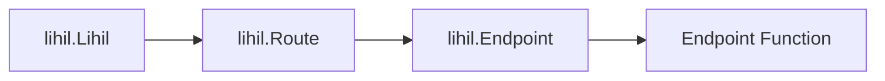

# Мини-курс

мы пройдём через некоторые из основных концепций, связанных с веб-разработкой, которые помогут вам лучше понять наши руководства.

## `Resource` (Ресурс)

### Любая идентифицируемая `сущность`, к которой можно получить доступ через URL

Не усложняйте—если вам не нравится термин `resource` (ресурс), думайте о нём как об `объекте`.

## `Entity` (Сущность)

Всё, что может быть уникально идентифицировано. Например:

```python
from dataclasses import dataclass, field
from uuid import uuid4

class User:
    user_id: str = field(default_factory=lambda: str(uuid4()))
```

Здесь `User` является сущностью, поскольку может быть уникально идентифицирован через `user_id`.
Это означает, что для любых двух экземпляров `User`, `u1` и `u2`, если `u1.user_id` == `u2.user_id`, то `u1 == u2`.

## `URI`

### Uniform Resource Identifier (Унифицированный идентификатор ресурса)

Строка, которая уникально идентифицирует ресурс. URI может быть URL, URN или и тем, и другим. URL следует формату:

> `protocol://domain/path?query#fragment`

`#fragment` обычно используется для навигации на стороне клиента, обычно он не нужен при написании серверного приложения.

Пример:

`https://myhost.com/users/lhl/orders?nums=3`

Когда вы видите RESTful API с URI подобным этому, даже без предварительных знаний, вы можете сделать вывод, что:

- Это веб-сайт, размещённый на `myhost.com`, использующий протокол `https`.
- Он обращается к ресурсу с именем `orders`, который принадлежит конкретному пользователю `lhl`.
- Он включает параметр запроса, `nums`, со значением `3`.

`URL` (Uniform Resource Locator - Унифицированный указатель ресурса): Тип URI, который не только идентифицирует ресурс, но и предоставляет способ доступа к нему. URL обычно включают схему (протокол), домен, путь, параметры запроса и, опционально, фрагмент.


## `ASGI`

ASGI означает `Asynchronous Server Gateway Interface` (Асинхронный интерфейс шлюза сервера), протокол, разработанный `encode`.


## `ASGIApp`

это асинхронный вызываемый объект со следующей сигнатурой.

```python
class ASGIApp(Protocol):
    async def __call__(self, scope, receive, send) -> None: ...
```

где

- `scope` это изменяемое отображение, часто `dict`.
- `receive` это асинхронный вызываемый объект, который не имеет параметров и возвращает `message`
- `message` также является изменяемым отображением, часто `dict`.
- `send` это асинхронный вызываемый объект, который принимает единственный параметр `message` и возвращает `None`

Многие компоненты, которые вы видите в `lihil`, реализуют `ASGIApp`, включая

- `Lihil`
- `Route`
- `Endpoint`
- `Response`

asgi промежуточное ПО (middleware) также являются `ASGIApp`.


### `ASGI Call Chain` (Цепочка вызовов ASGI)

`ASGIApp` часто связываются вместе как связанный список (вы можете узнать это как паттерн `chain of responsibility` - цепочка ответственности), где каждый вызов цепочки проходит через каждый узел цепочки, например, обычный стек вызовов выглядит так:



- `Endpoint Function` это функция, которую вы зарегистрировали с помощью `Route.{http method}`, такой как `Route.get`

- Если вы обслуживаете lihil с помощью ASGI сервера, такого как uvicorn, `lihil.Lihil` будет вызван uvicorn.


## Inversion of Control & Dependency Injection (Инверсия управления и внедрение зависимостей)

### Inversion of Control (Инверсия управления)

Хотя термин `Inversion of Control` (Инверсия управления) может звучать экзотично и причудливо, и может интерпретироваться на разных уровнях проектирования программного обеспечения, мы говорим здесь только об одном из его узких смыслов.

Представьте, что вы пишете модуль, который создаёт пользователя в базе данных, у вас может быть что-то вроде:

```python
from sqlalchemy.ext.asyncio import create_engine, AsyncEngine

class Repo:
    def __init__(self, engine: AsyncEngine):
        self.engine = engine

    async def add_user(self, user: User):
        prepared_stmt = sle.prepare_add_user(user)
        async with self.engine.connct() as conn:
            await conn.execute(prepared_stmt)

async def create_user(user: User, repo: Repository):
    await repo.add_user(user)

async def main():
    engine = create_engine(url=url)
    repo = Repo(engine)
    user = User(name="user")
    await create_user(user, repo)
```

Здесь вы вызываете `create_user` из вашей функции `main` внутри `main.py`, когда вы вводите `python -m myproject.main`, функции `main` и `create_user` вызываются.

Сравните с тем, что вы бы делали с lihil:

```python
users_route = Route("/users")

@users_route.post
async def create_user(user: User, repo: Repository):
    await repo.add_user(user)

lhl = Lihil(user_route)
```

Обратите внимание, что здесь, вместо того чтобы вы активно вызывали `create_user` из вашей функции, ваша функция вызывается lihil при поступлении запроса, а зависимости вашей `create_user` управляются и внедряются lihil.

Это пример `Inversion of Control` (Инверсии управления) и также одна из основных причин, почему специальный инструмент внедрения зависимостей `ididi` используется lihil.

### Сравнение с ручным построением зависимости внутри функции endpoint

Вы можете задаться вопросом, почему бы не строить зависимости самостоятельно внутри функции endpoint.

```python
@users_route.post
async def create_user(user: User):
    engine = create_engine(url=url)
    repo = Repo(engine)
    await repo.add_user(user)
```

Поскольку мы не внедряем динамически `Repo` в `create_user`, мы теряем преимущества:

- разделения интерфейса и реализации:
    1. часто мы хотим строить движок по-разному в зависимости от среды, в которой мы развёртываем наше приложение, например, вы можете захотеть увеличить размер пула соединений в продакшене.
    2. мы не будем выполнять реальные запросы во время тестирования, поэтому нам нужно будет замокать объект `Engine`.
    3. если мы создадим новый `AdvancedEngine(Engine)` для удовлетворения наших бизнес-потребностей, мы не сможем заставить `create_user` использовать его без изменения кода внутри.

- контроля времени жизни:
    Зависимости имеют разное время жизни, например,
    вы можете захотеть повторно использовать один и тот же `AsyncEngine` для разных запросов, но открывать новое `AsyncConnection` для обработки каждого запроса.