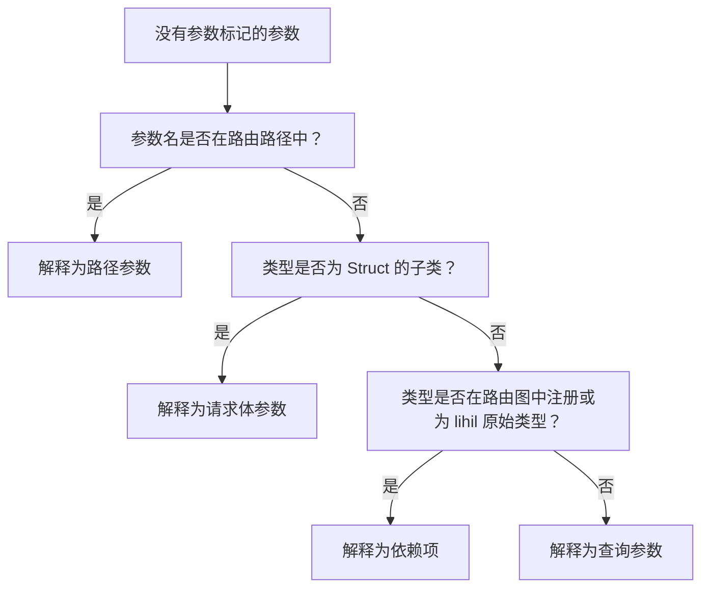

# 端点

`端点` 是 `lihil` 中最原子的 ASGI 组件，它定义了客户端如何与 `Route` 暴露的资源交互。

<!-- 在 [ASGI 调用链](./minicourse.md) 中，`endpoint` 通常在末尾。 -->

### 参数解析

```python
from lihil import Route
from ididi import NodeConfig
from typing import Annotated, NewType
from sqlalchemy.ext.asyncio import AsyncConnection, AsyncEngine


async def get_conn(engine: AsyncEngine) -> AsyncConnection:
    async with engine.begin() as conn:
        yield conn

UserID = NewType("UserID", str)

def user_id_factory() -> UserID:
    return UserID(str(uuid4()))

user_route = Route("/users", deps=[get_conn, (user_id_factory, NodeConfig(reuse=False))])

@user_route.post
async def create_user(
    user: UserData, user_id: UserID, conn: AsyncConnection
) -> Annotated[UserDB, stauts.Created]:

    sql = user_sql(user=user, id_=user_id)
    await conn.execute(sql)
    return UserDB.from_user(user, id=user_id)
```

这里，

1. `user_id` 将由 `user_id_factory` 创建并返回一个字符串形式的 uuid。
2. `conn` 将由 `get_conn` 创建并返回一个 `AsyncConnection` 实例，连接将在请求后返回给引擎。
3. `UserDB` 将被 JSON 序列化，并返回内容类型为 `application/json`、状态码为 `201` 的响应。

### 显式声明参数

使用 `Param` 显式声明参数告诉 Lihil 按原样处理它，不进行进一步分析。

**示例**：

```python
async def login(cred: Annotated[str, Param("header", alias="User-Credentials")], x_access_token: Annotated[str, Param("header")]) : ...
```

- 这里参数 `cred` 期望一个键为 `User-Credentials` 的头部。

- 如果没有提供键，将使用参数名的 kebab-case 形式，例如，这里 `x_access_token` 期望一个键为 `x-access-token` 的头部

#### 隐式声明参数

如果参数没有用任何参数标记声明，将应用以下规则来解析它：

- 如果参数名出现在路由路径中，它被解释为路径参数。
- 如果参数类型是 `msgspec.Struct` 的子类，它被解释为请求体参数。
- 如果参数类型在路由图中注册，或者是 lihil 原始类型，它将被解释为依赖项并由 lihil 解析

- 否则，它被解释为查询参数。



示例：

```python
from typing import Annotated
from lihil import Route, Payload

user_route = Route("/users/{user_id}", deps=[Cache, Engine])

class UserUpdate(Payload): ...
class Engine: ...
class Cache: ...


@user_route.put
async def update_user(user_id: str, engine: Engine, cache: Cache):
    return "ok"
```

在这个例子中：

- `user_id` 出现在路由路径中，所以它是一个路径参数
- `engine` 用 `Use` 标记注释，所以它是一个依赖项
- `cache` 在 user_route 中注册，所以它也是一个依赖项

只有 `user_id` 需要由客户端请求提供，其余将由 lihil 解析。

由于返回参数没有声明，`"ok"` 将被序列化为 JSON `'"ok"'`，状态码将是 `200`。

### 数据验证

lihil 使用 msgspec 为你提供开箱即用的数据验证功能。

### 约束

- 你可以结合 `typing.Annotated` 和 `Param` 对参数施加约束，

```python
from lihil import Param
all_users = Route("/users")

@all_users.get
async def get_users(numers: Annotated[int, Param(gt=0)]):
    ...
```

这里 `get_user` 期望一个查询参数 `numers`，一个值大于 `0` 的整数。

- 结构化数据的约束

```python
from typing import Annotated

from lihil import Payload, Param

UnixName = Annotated[
    str, Param(min_length=1, max_length=32, pattern="^[a-z_][a-z0-9_-]*$")
]

class User(Payload):
    name: UnixName
    groups: Annotated[set[UnixName], Param(max_length=16)] = set()
    cpu_limit: Annotated[float, Param(ge=0.1, le=8)] = 1
    mem_limit: Annotated[int, Param(ge=256, le=8192)] = 1024

@all_users.post
async def create_user(user: User): ...
```

这里 `create_user` 期望一个请求体参数 `user`，一个每个字段都有约束的结构化数据。

- 支持类型的约束

查看 [msgspec 约束](https://jcristharif.com/msgspec/constraints.html) 了解更多关于你可以在不同类型上设置的特定约束的详细信息。

### 返回标记

通常你想要改变端点的状态码或内容类型，要做到这一点，你可以使用一个或多个 `返回标记` 的组合。例如，要改变状态码：

```python
from lihil import Annotated, status

async def create_user(user: UserData, engine: Engine) -> Annotated[UserDB, status.Created]:
    ...
```

现在 `create_user` 将返回状态码 `201`，而不是默认的 `200`。

有几个返回标记你可能想要使用：

| 返回标记    | 目的                                                     | 类型参数                | 注意事项                               | 示例              |
| ----------- | -------------------------------------------------------- | ----------------------- | -------------------------------------- | ----------------- |
| `Json[T]`   | 内容类型为 `application/json` 的响应                     | `T`: 响应体类型         | 如果未指定则为默认返回类型             | `Json[list[int]]` |
| `Stream[T]` | 内容类型为 `text/event-stream` 的服务器发送事件          | `T`: 事件数据类型       | 用于事件流                             | `Stream[str]`     |
| `Text`      | 内容类型为 `text/plain` 的纯文本响应                     | 无                      | 用于简单文本响应                       | `Text`            |
| `HTML`      | 内容类型为 `text/html` 的 HTML 响应                      | 无                      | 用于 HTML 内容                         | `HTML`            |
| `Empty`     | 空响应（无请求体）                                       | 无                      | 表示没有内容返回                       | `Empty`           |

**示例**：

```python
from lihil import Json

async def demo() -> Json[list[int]]: ...
```

返回标记在 lihil 之外没有运行时/类型效果，你的类型检查器会把 `Json[T]` 当作 `T`。

#### 带状态码的响应

- `Annotated[T, status.OK]` 用于状态码为 `200` 的响应。其中 `T` 可以是任何 JSON 可序列化的内容，或另一个返回标记。

例如，在 `create_user` 示例中，我们使用 `Annotated[UserDB, status.Created]` 来声明我们的返回类型，这里 `T` 是 `UserDB`。

- 默认情况下，返回转换是 JSON 序列化的，所以它等同于 `Annotated[Json[UserDB], status.Created]`。
- 如果你想返回内容类型为 `text/html` 的响应，你可以使用 `HTML`

```python
async def hello() -> HTML:
    return "<p>hello, world!</p>"
```

#### 返回联合

返回多种类型的联合是有效的，它们将在 OpenAPI 规范中显示为 `anyOf` 模式。

```python
async def create_user() -> User | TemporaryUser: ...
```

#### 自定义编码器/解码器

你也可以为请求参数和函数返回使用自己的自定义编码器/解码器。

```python
def encoder_user_id(user_id: UUID) -> bytes:
    return str(user_id)

def decoder_user_id(user_id: str) -> UUID:
    return UUID(user_id)

user_route = Route("/users/{user_id}")

@user_route(encoder=encode_user_id)
async def get_user(
    user_id: Annotated[UUID, Param(decoder=decode_user_id)]
) -> str:
    return user_id
```

```python
def decoder[T](param: str | bytes) -> T: ...
```

- `decoder` 应该期望一个类型为 `str`（对于非请求体参数）或 `bytes`（对于请求体参数）的单个参数，并返回所需的参数类型，在 `decode_user_id` 的情况下，它是 `str`。

```python
def encoder[T](param: T) -> bytes: ...
```

- `encoder` 应该期望一个端点函数返回的任何类型的单个参数，在 `encode_user_id` 的情况下，它是 `str`，并返回字节。

### 属性

- 端点可以有这些属性：

```python title="lihil.routing"

class IEndpointProps(TypedDict, total=False):
    errors: Sequence[type[DetailBase[Any]]] | type[DetailBase[Any]]
    "可能从当前 `endpoint` 抛出的错误。这些将被视为响应并在 OpenAPI 文档中显示。"
    in_schema: bool
    "是否在 openapi 文档中包含此端点，默认为 True"
    to_thread: bool
    "此端点是否应在单独的线程中运行，仅适用于同步函数"
    scoped: Literal[True] | None
    "当前端点是否应该是作用域的，默认为 None"
    auth_scheme: AuthBase | None
    "访问控制的认证方案，默认为 None"
    tags: Sequence[str] | None
    "OAS 标签，具有相同标签的端点将被分组在一起，默认为路由标签"
    plugins: list[IPlugin]
    "装饰端点函数的装饰器"
    deps: list[DepNode] | None
    "可能在其中使用的依赖项 "
```

    - `scoped`: 如果端点需要任何作为异步上下文管理器的依赖项，或其工厂返回异步生成器，端点将是作用域的，将 scoped 设置为 None 不会改变这一点，但是，对于非作用域的端点，设置 `scoped=True` 会使其成为作用域的。

### 覆盖端点属性

你可以通过在路由装饰器中更改端点属性来改变它们。

```python
@router.get(errors=[UserNotFoundError, UserInactiveError])
async get_user(user_id: str): ...
```

### 为路由中的每个端点提供属性：

你可以在初始化路由时提供默认属性，

```python
from lihil.routing import Route, EndpointProps

default_props = EndpointProps(errors=[UserNotFoundError, UserInactiveError])
prop_route = Route(props=default_props)
```

- 这里 `default_props` 将应用于添加到 `prop_route` 的每个端点。
- 通过路由装饰器（如 `route.get`）提供的端点属性将覆盖路由提供的属性。