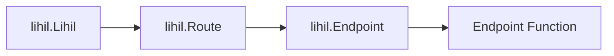

# 小课程

我们将学习一些与 web 开发相关的常见概念，这将帮助你更好地理解我们的教程。

## `Resource` 资源

### 任何可以通过 URL 访问的可识别 `实体`

不要过度思考——如果你不喜欢 `resource` 这个术语，可以把它想象成一个 `object` 对象。

## `Entity` 实体

任何可以被唯一识别的东西。例如

```python
from dataclasses import dataclass, field
from uuid import uuid4

class User:
    user_id: str = field(default_factory=lambda: str(uuid4()))
```

这里，`User` 是一个实体，因为它可以通过 `user_id` 唯一识别。
这意味着，对于任何给定的两个 `User` 实例 `u1` 和 `u2`，如果 `u1.user_id` == `u2.user_id`，那么 `u1 == u2`。

## `URI`

### 统一资源标识符

一个唯一标识资源的字符串。URI 可以是 URL、URN 或两者。URL 遵循以下格式：

> `protocol://domain/path?query#fragment`

`#fragment` 通常用于客户端导航，在编写服务器端应用程序时通常不需要它。

示例：

`https://myhost.com/users/lhl/orders?nums=3`

当你看到这样的 RESTful API URI 时，即使没有先验知识，你也可以推断出：

- 这是一个托管在 `myhost.com` 的网站，使用 `https` 协议。
- 它正在访问一个名为 `orders` 的资源，该资源属于特定用户 `lhl`。
- 它包含一个查询参数 `nums`，值为 `3`。

`URL`（统一资源定位器）：一种 URI 类型，不仅标识资源，还提供访问资源的方法。URL 通常包括协议（scheme）、域名、路径、查询参数，以及可选的片段。


## `ASGI`

ASGI 指的是 `Asynchronous Server Gateway Interface`，这是由 `encode` 设计的协议。


## `ASGIApp`

是一个具有以下签名的异步可调用对象。

```python
class ASGIApp(Protocol):
    async def __call__(self, scope, receive, send) -> None: ...
```

其中

- `scope` 是一个可变映射，通常是一个 `dict`。
- `receive` 是一个异步可调用对象，没有参数并返回一个 `message`
- `message` 也是一个可变映射，通常是 `dict`。
- `send` 是一个异步可调用对象，接收单个参数 `message` 并返回 `None`

你从 `lihil` 中看到的许多组件都实现了 `ASGIApp`，包括

- `Lihil`
- `Route`
- `Endpoint`
- `Response`

ASGI 中间件也是 `ASGIApp`。


### `ASGI 调用链`

`ASGIApp` 通常像链表一样链接在一起（你可能会认识这是`责任链`模式），其中对链的每次调用都会经过链上的每个节点，例如，一个普通的调用栈看起来像这样



- `Endpoint Function` 是你使用 `Route.{http method}` 注册的函数，如 `Route.get`

- 如果你使用 ASGI 服务器（如 uvicorn）来服务 lihil，`lihil.Lihil` 将被 uvicorn 调用。


## 控制反转 & 依赖注入

### 控制反转

虽然 `控制反转` 这个术语可能听起来奇特和花哨，并且可以在软件设计的不同层面进行解释，但我们这里只讨论其狭义的含义之一。

想象你正在编写一个在数据库中创建用户的模块，你可能有这样的代码：

```python
from sqlalchemy.ext.asyncio import create_engine, AsyncEngine

class Repo:
    def __init__(self, engine: AsyncEngine):
        self.engine = engine

    async def add_user(self, user: User):
        prepared_stmt = sle.prepare_add_user(user)
        async with self.engine.connct() as conn:
            await conn.execute(prepared_stmt)

async def create_user(user: User, repo: Repository):
    await repo.add_user(user)

async def main():
    engine = create_engine(url=url)
    repo = Repo(engine)
    user = User(name="user")
    await create_user(user, repo)
```

这里你从 `main.py` 中的 `main` 函数调用 `create_user`，当你执行 `python -m myproject.main` 时，函数 `main` 和 `create_user` 会被调用。

与你使用 lihil 的做法相比：

```python
users_route = Route("/users")

@users_route.post
async def create_user(user: User, repo: Repository):
    await repo.add_user(user)

lhl = Lihil(user_route)
```

注意这里，你不是主动从你的函数中调用 `create_user`，而是在请求到达时由 lihil 调用你的函数，并且你的 `create_user` 的依赖项由 lihil 管理和注入。

这是 `控制反转` 的一个例子，也是 lihil 使用专用依赖注入工具 `ididi` 的主要原因之一。

### 与在端点函数内手动构建依赖项的比较

你可能想知道为什么不在端点函数内自己构建依赖项。

```python
@users_route.post
async def create_user(user: User):
    engine = create_engine(url=url)
    repo = Repo(engine)
    await repo.add_user(user)
```

由于我们没有动态地将 `Repo` 注入到 `create_user` 中，我们失去了以下好处：

- 接口和实现的分离：
    1. 通常我们希望根据部署应用的环境不同地构建引擎，例如，你可能希望在生产环境中增加连接池的大小。
    2. 在测试期间我们不会执行真正的查询，所以我们需要模拟 `Engine` 对象。
    3. 如果我们创建一个新的 `AdvancedEngine(Engine)` 来满足我们的业务需求，我们无法让 `create_user` 使用它而不修改内部代码。

- 生命周期控制：
    依赖项有不同的生命周期，例如，
    你可能希望在不同的请求之间重用相同的 `AsyncEngine`，但为每个请求打开一个新的 `AsyncConnection`。